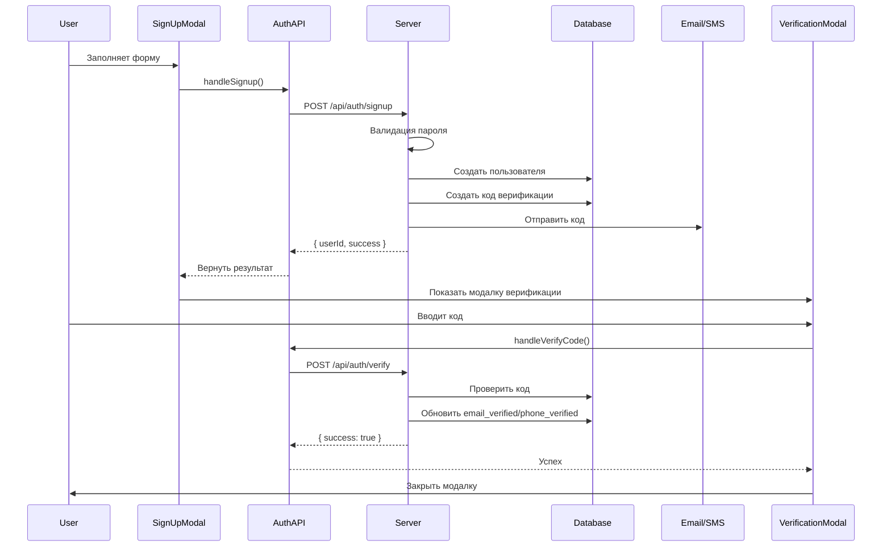
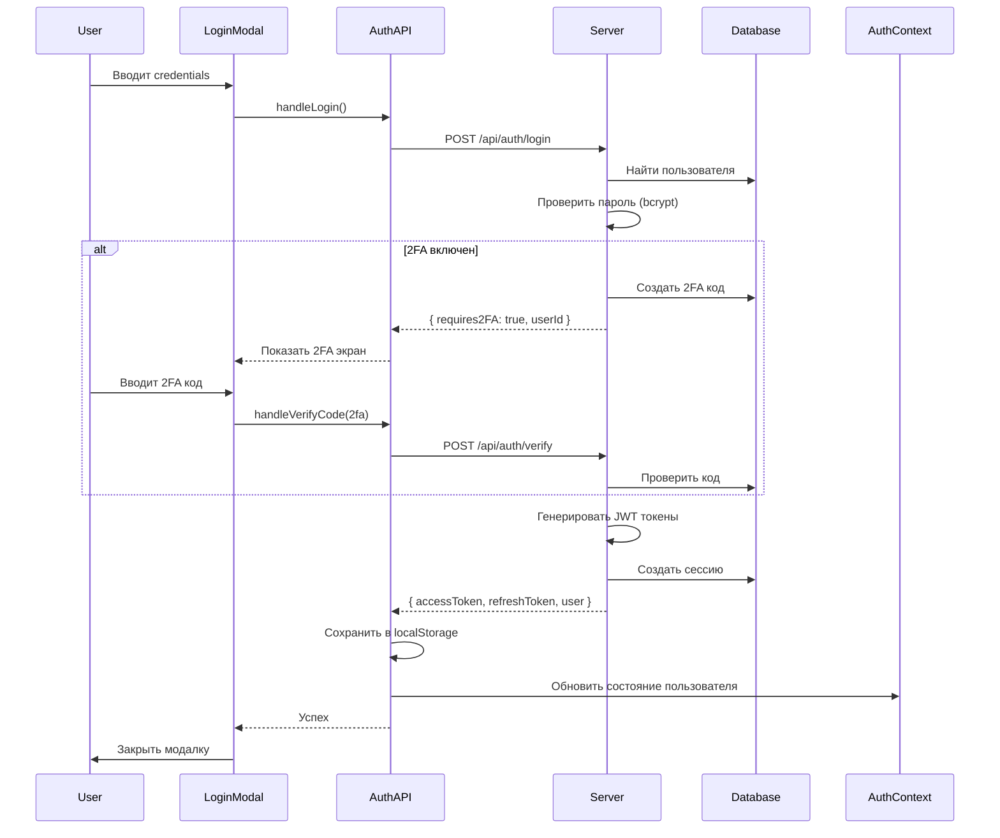
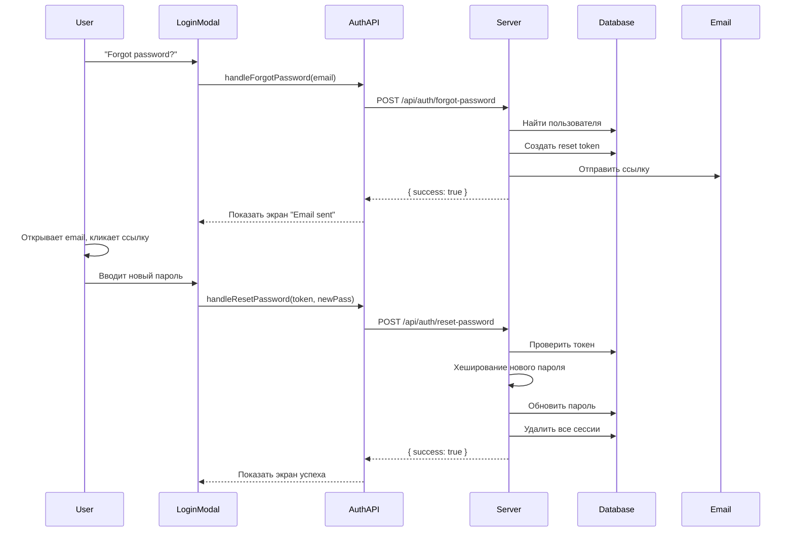

# Архитектура системы авторизации

## 📁 Структура проекта

```
project-root/
├── server/
│   ├── config/
│   │   └── database.ts          # Конфигурация БД, схемы, миграции
│   ├── middleware/
│   │   └── auth.ts              # Middleware для защиты роутов
│   ├── routes/
│   │   ├── auth.ts              # Все эндпоинты авторизации
│   │   └── demo.ts              # Демо роуты
│   ├── utils/
│   │   └── auth.ts              # Утилиты (JWT, bcrypt, валидация)
│   └── index.ts                 # Главный файл сервера
│
├── client/
│   ├── components/
│   │   ├── auth/
│   │   │   ├── LoginModal.tsx   # Модалка логина (уже есть)
│   │   │   ├── SignUpModal.tsx  # Модалка регистрации (уже есть)
│   │   │   └── VerificationModal.tsx # Модалка верификации (уже есть)
│   │   └── ui/
│   │       └── AvatarDropdown/
│   │           └── AvatarDropdown.tsx # Обновлено с Login кнопкой
│   ├── contexts/
│   │   └── AuthContext.tsx      # Контекст авторизации
│   ├── hooks/
│   │   └── useAuthIntegration.tsx # Хук для интеграции с модалками
│   ├── lib/
│   │   └── api/
│   │       └── auth.ts          # API клиент для авторизации
│   └── App.tsx                  # Обернуть в AuthProvider
│
├── .env.example                 # Пример переменных окружения
├── .env                         # Ваши реальные переменные (не коммитить!)
├── SETUP_AUTH.md                # Полное руководство по настройке
├── INTEGRATION_STEPS.md         # Шаги интеграции с модалками
└── AUTH_ARCHITECTURE.md         # Этот файл
```

---

## 🔄 Поток авторизации

### 1. Регистрация (Signup)



### 2. Вход (Login)



### 3. Восстановление пароля



---

## 🔐 Безопасность

### 1. Хеширование паролей (bcrypt)

```typescript
// При регистрации
const passwordHash = await bcrypt.hash(password, 10);

// При логине
const isValid = await bcrypt.compare(password, passwordHash);
```

### 2. JWT токены

```typescript
// Access Token (15 минут)
const accessToken = jwt.sign(
  { userId, email },
  JWT_SECRET,
  { expiresIn: '15m' }
);

// Refresh Token (7 дней)
const refreshToken = jwt.sign(
  { userId, email },
  JWT_REFRESH_SECRET,
  { expiresIn: '7d' }
);
```

### 3. Защита от брутфорса

```typescript
// После 5 неудачных попыток
if (failedAttempts >= 5) {
  // Блокировка аккаунта на 15 минут
  user.is_blocked = true;
  user.block_until = new Date(Date.now() + 15 * 60 * 1000);
}
```

### 4. Rate Limiting

```typescript
// Максимум 10 запросов в 15 минут
router.post('/login', rateLimit(10, 15 * 60 * 1000), ...);
```

### 5. Валидация паролей

- Минимум 12 символов
- Заглавн��е и строчные буквы
- Цифры
- Специальные символы

---

## 💾 База данных

### Схема таблиц

#### users
```sql
id              UUID PRIMARY KEY
email           VARCHAR(255) UNIQUE
phone           VARCHAR(20) UNIQUE
password_hash   VARCHAR(255) NOT NULL
first_name      VARCHAR(100)
last_name       VARCHAR(100)
avatar_url      TEXT
email_verified  BOOLEAN DEFAULT FALSE
phone_verified  BOOLEAN DEFAULT FALSE
two_factor_enabled BOOLEAN DEFAULT FALSE
is_blocked      BOOLEAN DEFAULT FALSE
failed_login_attempts INTEGER DEFAULT 0
created_at      TIMESTAMP
updated_at      TIMESTAMP
```

#### sessions
```sql
id              UUID PRIMARY KEY
user_id         UUID REFERENCES users(id)
token           VARCHAR(500) UNIQUE
refresh_token   VARCHAR(500) UNIQUE
expires_at      TIMESTAMP
device_info     TEXT
ip_address      VARCHAR(45)
created_at      TIMESTAMP
```

#### verification_codes
```sql
id              UUID PRIMARY KEY
user_id         UUID REFERENCES users(id)
code            VARCHAR(10)
type            VARCHAR(50) -- email_verification, phone_verification, 2fa
expires_at      TIMESTAMP
attempts        INTEGER DEFAULT 0
is_used         BOOLEAN DEFAULT FALSE
created_at      TIMESTAMP
```

#### password_resets
```sql
id              UUID PRIMARY KEY
user_id         UUID REFERENCES users(id)
token           VARCHAR(500) UNIQUE
expires_at      TIMESTAMP
is_used         BOOLEAN DEFAULT FALSE
created_at      TIMESTAMP
```

---

## 🔌 API Endpoints

| Метод | Endpoint | Описание | Auth Required |
|-------|----------|----------|---------------|
| POST | `/api/auth/signup` | Регистрация | ❌ |
| POST | `/api/auth/login` | Вход | ❌ |
| POST | `/api/auth/verify` | Верификация кода | ❌ |
| POST | `/api/auth/refresh` | Обновление токена | ❌ |
| POST | `/api/auth/forgot-password` | Запрос сброса пароля | ❌ |
| POST | `/api/auth/reset-password` | Сброс пароля | ❌ |
| POST | `/api/auth/logout` | Выход | ✅ |
| GET | `/api/user/profile` | Получить профиль | ✅ |
| PATCH | `/api/user/profile` | Обновить профиль | ✅ |

---

## 🎨 Интеграция с фронтендом

### Использование AuthContext

```tsx
import { useAuth } from '@/contexts/AuthContext';

function MyComponent() {
  const {
    user,              // Текущий пользователь
    isLoading,         // Загрузка
    isAuthenticated,   // Авторизован ли
    login,             // Функция входа
    logout,            // Функция выхода
    signup             // Функция регистрации
  } = useAuth();

  // Использование
}
```

### Защищенные компоненты

```tsx
function ProtectedPage() {
  const { isAuthenticated, isLoading } = useAuth();
  
  if (isLoading) return <Loading />;
  if (!isAuthenticated) return <Navigate to="/" />;
  
  return <YourContent />;
}
```

### Автоматический refresh токена

Axios interceptor в `client/lib/api/auth.ts` автоматически:
1. Добавляет `Authorization` header
2. Обновляет истекшие токены
3. Перенаправляет на логин при ошибке

---

## 📊 Мониторинг и логирование

### Важные метрики

1. **Успешные регистрации**: `COUNT(*) FROM users WHERE created_at > NOW() - INTERVAL '24 hours'`
2. **Активные сессии**: `COUNT(*) FROM sessions WHERE expires_at > NOW()`
3. **Неудачные попытки входа**: `SUM(failed_login_attempts) FROM users`
4. **Заблокированные аккаунты**: `COUNT(*) FROM users WHERE is_blocked = TRUE`

### Логирование

```typescript
// В production добавьте Winston или Pino
console.log('[AUTH] User registered:', userId);
console.error('[AUTH] Login failed:', error);
```

---

## 🚀 Развертывание

### 1. Переменные окружения

```bash
# Production .env
NODE_ENV=production
JWT_SECRET=<strong-random-secret>
JWT_REFRESH_SECRET=<another-strong-secret>
SUPABASE_URL=https://your-project.supabase.co
SUPABASE_SERVICE_KEY=<service-role-key>
CLIENT_URL=https://yourdomain.com
```

### 2. Безопасность

- ✅ HTTPS обязательно
- ✅ Secure cookies для токенов (опционально)
- ✅ CORS правильно настроен
- ✅ Rate limiting включен
- ✅ Секреты в .env (не в коде!)

### 3. Масштабирование

- Redis для rate limiting (вместо in-memory)
- Отдельная очередь для отправки email/SMS
- CDN для статики
- Load balancer для API

---

## 🧪 Тестирование

### Unit tests

```typescript
describe('Auth Utils', () => {
  it('should hash password', async () => {
    const hash = await hashPassword('Test123!@#');
    expect(hash).toBeDefined();
  });

  it('should validate strong password', () => {
    const result = validatePassword('StrongPass123!');
    expect(result.valid).toBe(true);
  });
});
```

### Integration tests

```typescript
describe('POST /api/auth/signup', () => {
  it('should create new user', async () => {
    const res = await request(app)
      .post('/api/auth/signup')
      .send({ email: 'test@example.com', password: 'Test123!@#' });
    
    expect(res.status).toBe(201);
    expect(res.body.userId).toBeDefined();
  });
});
```

---

## 📝 Чек-лист для production

- [ ] Установлены все зависимости
- [ ] Создана база данных (Supabase/Neon)
- [ ] Выполнены миграции
- [ ] Настроены переменные окружения
- [ ] JWT секреты сгенерированы
- [ ] Email/SMS сервисы настроены
- [ ] HTTPS настроен
- [ ] CORS правильно сконфигурирован
- [ ] Rate limiting работает
- [ ] Логирование настроено
- [ ] Протестированы все flow
- [ ] Backup базы данных настроен

---

**Готово к использованию!** 🎉

Полная, безопасная, масштабируемая система авторизации готова к деплою.
