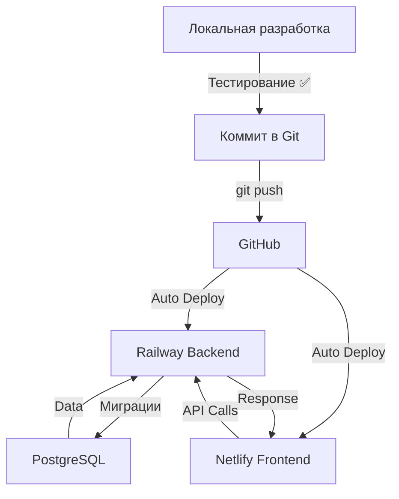

# Руководство по деплою на Railway & Netlify

## 🎯 Стратегия деплоя

```
┌─────────────────────────────────────────────────┐
│  DEVELOPMENT (Локальная разработка)             │
│  ├── Frontend: http://localhost:5173           │
│  ├── Backend: http://localhost:8080            │
│  └── Database: PostgreSQL localhost:5432       │
└─────────────────────────────────────────────────┘
                    │
                    │ Тестирование ✅
                    │
                    ▼
┌─────────────────────────────────────────────────┐
│  PRODUCTION (Облачный деплой)                   │
│                                                  │
│  ┌────────────────────────────────────────────┐ │
│  │  Netlify.com                               │ │
│  │  Frontend (React)                          │ │
│  │  https://your-app.netlify.app              │ │
│  └────────────────────────────────────────────┘ │
│                    │                             │
│                    │ API Requests                │
│                    ▼                             │
│  ┌────────────────────────────────────────────┐ │
│  │  Railway.com                               │ │
│  │  GoToSocial Backend (Go)                   │ │
│  │  https://gotosocial.railway.app            │ │
│  │  ├── GoToSocial App                        │ │
│  │  └── PostgreSQL Database                   │ │
│  └────────────────────────────────────────────┘ │
└─────────────────────────────────────────────────┘
```

---

## 📋 План деплоя

### Последовательность:

1. ✅ **Разработка и тестирование локально**
2. 🚀 **Деплой Backend на Railway.com** (GoToSocial + PostgreSQL)
3. 🚀 **Деплой Frontend на Netlify.com** (React приложение)
4. ✅ **Тестирование в production**

---

## 🔧 Часть 1: Локальное тестирование

### Перед деплоем протестируйте локально:

```bash
# 1. Запустите GoToSocial
cd gotosocial
./gotosocial --config-path ./config.yaml server start

# 2. Запустите Frontend
npm run dev

# 3. Тестируйте функционал:
# - Создание постов с custom_metadata
# - Фильтрация timeline
# - Отображение метаданных
# - Profile, Notifications, etc.
```

### Чеклист перед деплоем:

- [ ] ✅ Backend запускается без ошибок
- [ ] ✅ Frontend подключается к backend
- [ ] ✅ Создание постов работает
- [ ] ✅ Timeline фильтрация работает
- [ ] ✅ custom_metadata сохраняется и отображается
- [ ] ✅ Все тесты проходят (`go test ./...`)

---

## 🚂 Часть 2: Деплой Backend на Railway.com

### 2.1. Подготовка проекта GoToSocial

#### Создайте `railway.json` в директории `gotosocial/`:

```json
{
  "$schema": "https://railway.app/railway.schema.json",
  "build": {
    "builder": "NIXPACKS"
  },
  "deploy": {
    "startCommand": "./gotosocial --config-path ./config.yaml server start",
    "restartPolicyType": "ON_FAILURE",
    "restartPolicyMaxRetries": 10
  }
}
```

#### Создайте `Dockerfile` в директории `gotosocial/` (опционально, если nixpacks не работает):

```dockerfile
FROM golang:1.21-alpine AS builder

WORKDIR /app

# Copy go mod files
COPY go.mod go.sum ./
RUN go mod download

# Copy source code
COPY . .

# Build
RUN go build -o gotosocial ./cmd/gotosocial

# Runtime stage
FROM alpine:latest

RUN apk --no-cache add ca-certificates

WORKDIR /gotosocial

# Copy binary and config
COPY --from=builder /app/gotosocial .
COPY --from=builder /app/config.yaml .

# Expose port
EXPOSE 8080

CMD ["./gotosocial", "--config-path", "./config.yaml", "server", "start"]
```

### 2.2. Настройка Railway.com

#### Шаг 1: Создайте новый проект

1. Зайдите на [Railway.com](https://railway.app)
2. Нажмите "New Project"
3. Выберите "Deploy from GitHub repo"
4. Выберите ваш репозиторий
5. Выберите директорию `gotosocial/` как root directory

#### Шаг 2: Добавьте PostgreSQL

1. В проекте нажмите "New" → "Database" → "Add PostgreSQL"
2. Railway автоматически создаст database
3. Railway автоматически добавит переменные окружения:
   - `DATABASE_URL`
   - `PGHOST`
   - `PGPORT`
   - `PGUSER`
   - `PGPASSWORD`
   - `PGDATABASE`

#### Шаг 3: Настройте Environment Variables

В Railway добавьте переменные окружения для GoToSocial:

```bash
# Server Configuration
GTS_HOST=0.0.0.0
GTS_PORT=8080
GTS_PROTOCOL=https
GTS_BIND_ADDRESS=0.0.0.0

# Database (Railway автоматически заполнит)
GTS_DB_TYPE=postgres
GTS_DB_ADDRESS=${{PGHOST}}
GTS_DB_PORT=${{PGPORT}}
GTS_DB_USER=${{PGUSER}}
GTS_DB_PASSWORD=${{PGPASSWORD}}
GTS_DB_DATABASE=${{PGDATABASE}}

# Domain (получите от Railway после деплоя)
GTS_ACCOUNT_DOMAIN=gotosocial-production.up.railway.app
GTS_TRUSTED_PROXIES=*

# Storage (можно использовать локальное хранилище или S3)
GTS_STORAGE_BACKEND=local
GTS_STORAGE_LOCAL_BASE_PATH=/data

# Admin account (создайте первого пользователя)
GTS_ADMIN_ACCOUNT_USERNAME=admin
GTS_ADMIN_ACCOUNT_EMAIL=admin@example.com
```

#### Шаг 4: Deploy

1. Railway автоматически начнёт деплой
2. Дождитесь успешного деплоя
3. Railway выдаст URL: `https://gotosocial-production.up.railway.app`
4. Обновите `GTS_ACCOUNT_DOMAIN` на этот URL

#### Шаг 5: Создайте первого пользователя

После деплоя, выполните в Railway CLI:

```bash
# Подключитесь к Railway
railway login

# Выберите ваш проект
railway link

# Выполните команду создания пользователя
railway run gotosocial --config-path ./config.yaml admin account create \
  --username admin \
  --email admin@example.com \
  --password YourSecurePassword123

# Подтвердите email
railway run gotosocial --config-path ./config.yaml admin account confirm \
  --username admin
```

### 2.3. Миграция базы данных

Railway автоматически запустит GoToSocial, который применит все миграции, включая:
- ✅ `20251025181700_add_custom_metadata.go` (наша кастомная миграция)

Проверьте логи в Railway dashboard, чтобы убедиться что миграция прошла успешно.

---

## 🌐 Часть 3: Деплой Frontend на Netlify.com

### 3.1. Подготовка проекта

#### Создайте `netlify.toml` в **корне проекта**:

```toml
[build]
  # Команда сборки
  command = "npm run build"
  
  # Директория с собранными файлами
  publish = "dist"

# Переадресация для SPA (Single Page Application)
[[redirects]]
  from = "/*"
  to = "/index.html"
  status = 200

# Environment variables (публичные)
[context.production.environment]
  NODE_VERSION = "18"
```

#### Обновите `.env.production`:

Создайте файл `.env.production` в корне проекта:

```bash
# Production GoToSocial API URL (получите от Railway)
VITE_GOTOSOCIAL_API_URL=https://gotosocial-production.up.railway.app

# Другие production настройки
VITE_OAUTH_CLIENT_ID=your_production_client_id
VITE_OAUTH_REDIRECT_URI=https://your-app.netlify.app/auth/callback
```

**⚠️ ВАЖНО:** НЕ коммитьте `.env.production` с секретами в git!

### 3.2. Настройка Netlify.com

#### Шаг 1: Подключите GitHub репозиторий

1. Зайдите на [Netlify.com](https://netlify.com)
2. Нажмите "Add new site" → "Import an existing project"
3. Выберите ваш GitHub репозиторий
4. Настройте:
   - **Branch to deploy:** `main` (или ваша production ветка)
   - **Build command:** `npm run build`
   - **Publish directory:** `dist`

#### Шаг 2: Environment Variables

В Netlify dashboard → Site settings → Environment variables, добавьте:

```bash
# Backend URL
VITE_GOTOSOCIAL_API_URL=https://gotosocial-production.up.railway.app

# OAuth (создайте OAuth app в GoToSocial admin)
VITE_OAUTH_CLIENT_ID=your_client_id
VITE_OAUTH_CLIENT_SECRET=your_client_secret
VITE_OAUTH_REDIRECT_URI=https://your-app.netlify.app/auth/callback
```

#### Шаг 3: Deploy

1. Нажмите "Deploy site"
2. Netlify начнёт сборку
3. После успешной сборки получите URL: `https://your-app.netlify.app`

#### Шаг 4: Custom Domain (опционально)

1. В Netlify → Domain settings
2. Добавьте свой домен
3. Настройте DNS записи
4. Обновите `VITE_OAUTH_REDIRECT_URI` на новый домен

---

## 🔐 Часть 4: CORS & OAuth настройка

### 4.1. Настройка CORS в GoToSocial

В Railway environment variables для GoToSocial добавьте:

```bash
# Разрешить CORS для вашего фронтенда
GTS_CORS_ALLOW_ORIGINS=https://your-app.netlify.app

# Или для множественных доменов
GTS_CORS_ALLOW_ORIGINS=https://your-app.netlify.app,https://custom-domain.com
```

### 4.2. Создание OAuth Application

После деплоя GoToSocial, создайте OAuth приложение:

```bash
# Через Railway CLI или админ панель
# Создайте OAuth app с redirect URI: https://your-app.netlify.app/auth/callback
```

Получите `client_id` и `client_secret`, добавьте их в Netlify environment variables.

---

## 🧪 Часть 5: Тестирование Production

### Чеклист после деплоя:

```bash
# 1. Backend доступен
curl https://gotosocial-production.up.railway.app/api/v1/instance

# 2. Frontend загружается
# Откройте https://your-app.netlify.app

# 3. API запросы работают
# В браузере DevTools → Network, проверьте запросы к Railway

# 4. Создание поста с метаданными
# Используйте Create Post Modal, добавьте metadata

# 5. Фильтрация работает
# Попробуйте фильтры на Feed странице
```

### Тестируйте функционал:

- [ ] ✅ Регистрация/вход работает
- [ ] ✅ Создание постов с custom_metadata
- [ ] ✅ Timeline с фильтрацией
- [ ] ✅ Profile страница загружается
- [ ] ✅ Notifications работают
- [ ] ✅ Media upload работает
- [ ] ✅ Follow/unfollow работает

---

## 🔄 CI/CD - Автоматический деплой

### GitHub Actions для автоматического деплоя:

Создайте `.github/workflows/deploy.yml`:

```yaml
name: Deploy to Production

on:
  push:
    branches:
      - main

jobs:
  deploy-frontend:
    runs-on: ubuntu-latest
    steps:
      - uses: actions/checkout@v3
      - uses: actions/setup-node@v3
        with:
          node-version: '18'
      
      - name: Install dependencies
        run: npm ci
      
      - name: Build
        env:
          VITE_GOTOSOCIAL_API_URL: ${{ secrets.GOTOSOCIAL_API_URL }}
        run: npm run build
      
      - name: Deploy to Netlify
        uses: netlify/actions/cli@master
        env:
          NETLIFY_AUTH_TOKEN: ${{ secrets.NETLIFY_AUTH_TOKEN }}
          NETLIFY_SITE_ID: ${{ secrets.NETLIFY_SITE_ID }}
        with:
          args: deploy --prod --dir=dist

  test-backend:
    runs-on: ubuntu-latest
    steps:
      - uses: actions/checkout@v3
      - uses: actions/setup-go@v4
        with:
          go-version: '1.21'
      
      - name: Run tests
        working-directory: ./gotosocial
        run: go test ./...
```

---

## 📊 Мониторинг и логи

### Railway.com:

1. **Логи:** Railway Dashboard → Deployments → View logs
2. **Metrics:** CPU, Memory, Network usage
3. **Database:** Автоматические бэкапы PostgreSQL

### Netlify.com:

1. **Deploy logs:** Netlify Dashboard → Deploys → Build log
2. **Function logs:** (если используете Netlify Functions)
3. **Analytics:** Netlify Analytics (платная опция)

---

## 🛠️ Troubleshooting

### Проблема: Backend не запускается на Railway

**Решение:**
```bash
# Проверьте логи в Railway
# Убедитесь что все env variables установлены
# Проверьте что PORT=8080 (Railway использует этот порт)
```

### Проблема: Frontend не может подключиться к Backend

**Решение:**
```bash
# 1. Проверьте CORS настройки в GoToSocial
# 2. Убедитесь что VITE_GOTOSOCIAL_API_URL правильный
# 3. Проверьте Network tab в DevTools
```

### Проблема: OAuth не работает

**Решение:**
```bash
# 1. Проверьте redirect URI в OAuth app
# 2. Убедитесь что client_id и client_secret правильные
# 3. Проверьте что домен совпадает
```

### Проблема: Миграция custom_metadata не применилась

**Решение:**
```bash
# Подключитесь к Railway CLI
railway link
railway run ./gotosocial --config-path ./config.yaml admin db migrate

# Или проверьте логи - миграция должна была примениться автоматически
```

---

## 💰 Стоимость

### Railway.com:
- **Starter Plan:** $5/месяц
- **PostgreSQL:** Включена в Starter
- **Bandwidth:** 100GB/месяц

### Netlify.com:
- **Free Tier:** 
  - 100GB bandwidth/месяц
  - 300 build minutes/месяц
  - Достаточно для большинства проектов
- **Pro:** $19/месяц (если нужно больше)

**Итого:** ~$5-10/месяц для production

---

## 📝 Чеклист полного деплоя

### Локальная разработка:
- [ ] ✅ GoToSocial работает локально
- [ ] ✅ Frontend работает локально
- [ ] ✅ custom_metadata функционал протестирован
- [ ] ✅ Все тесты проходят

### Railway.com (Backend):
- [ ] ✅ Проект создан на Railway
- [ ] ✅ PostgreSQL добавлена
- [ ] ✅ Environment variables настроены
- [ ] ✅ GoToSocial успешно задеплоен
- [ ] ✅ Миграция custom_metadata применилась
- [ ] ✅ Первый пользователь создан
- [ ] ✅ API доступен по HTTPS

### Netlify.com (Frontend):
- [ ] ✅ Проект создан на Netlify
- [ ] ✅ GitHub репозиторий подключен
- [ ] ✅ Environment variables настроены
- [ ] ✅ Build успешно прошёл
- [ ] ✅ Frontend доступен по HTTPS
- [ ] ✅ CORS работает

### Production тестирование:
- [ ] ✅ Создание постов с метаданными
- [ ] ✅ Фильтрация timeline
- [ ] ✅ Profile, Notifications
- [ ] ✅ OAuth работает
- [ ] ✅ Media upload работает

---

## 🎯 Итоговый Workflow



**Процесс:**
1. ✅ Разработка локально
2. ✅ Тестирование функционала
3. ✅ Git commit & push
4. 🚀 Railway автоматически деплоит backend
5. 🚀 Netlify автоматически деплоит frontend
6. ✅ Production тестирование

---

**Автор:** AI Assistant  
**Дата:** 25 октября 2025  
**Статус:** ✅ Готово к деплою
