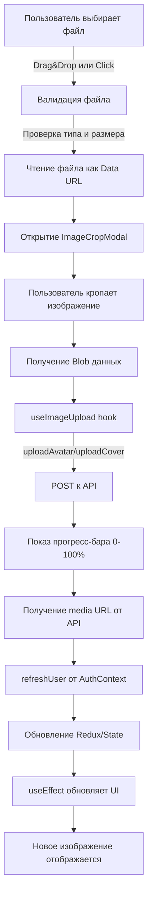

# 📊 Структура страниц профиля

## Обзор

В проекте существует **две разные реализации** страниц профиля с различными компонентами для отображения аватара и баннера.

---

## 🎯 Два типа страниц профиля

### 1. `/profile` - Страница профиля пользователя (собственный профиль)
- **Компонент:** `client/pages/ProfileNew.tsx`
- **Главный UI компонент:** `UserHeader`
- **Источник данных:** Redux Store + AuthContext

### 2. `/profile-page` или `/@username` - Страница профиля (чужой/собственный)
- **Компонент:** `client/pages/OtherProfilePage.tsx`
- **Главный UI компонент:** `ProfileHero`
- **Источник данных:** API через `useCustomUserProfile` hook

---

## 🏗️ Архитектура компонентов

### Страница `/profile` (ProfileNew.tsx)

```
ProfileNew (client/pages/ProfileNew.tsx)
│
├── UserHeader (client/components/UserHeader/UserHeader.tsx)
│   ├── 📸 Аватар
│   │   ├── Круглая форма
│   │   ├── Бордер по уровню (level-based)
│   │   ├── Glow эффект
│   │   ├── Drag & Drop загрузка
│   │   └── Hover эффект с иконкой камеры
│   │
│   ├── 🖼️ Баннер/Обложка
│   │   ├── Прямоугольная форма (3:1 aspect ratio)
│   │   ├── Градиент оверлей
│   │   ├── Drag & Drop загрузка
│   │   └── Hover эффект с текстом "Update cover"
│   │
│   └── ℹ️ Информация пользователя
│       ├── Имя + username
│       ├── Bio
│       ├── Location, Website
│       ├── Join date
│       └── Following/Followers счетчики
│
└── Контент вкладок (Profile/Social/etc.)
```

### Страница `/profile-page` (OtherProfilePage.tsx)

```
OtherProfilePage (client/pages/OtherProfilePage.tsx)
│
├── ProfilePageLayout (client/components/socialProfile/ProfilePageLayout.tsx)
│   │
│   ├── ProfileContentClassic (client/components/socialProfile/ProfileContentClassic.tsx)
│   │   │
│   │   └── ProfileHero (client/components/socialProfile/ProfileHero.tsx)
│   │       ├── 📸 Аватар
│   │       │   ├── Круглая форма
│   │       │   ├── Бордер по уровню (level-based)
│   │       │   ├── Glow эффект
│   │       │   ├── Drag & Drop загрузка
│   │       │   └── Hover эффект с иконкой камеры
│   │       │
│   │       ├── 🖼️ Баннер/Обложка
│   │       │   ├── Прямоугольная форма (3:1 aspect ratio)
│   │       │   ├── Градиент оверлей
│   │       │   ├── Drag & Drop загрузка
│   │       │   └── Hover эффект с текстом "Update cover"
│   │       │
│   │       ├── ℹ️ Информация пользователя
│   │       └── 🎮 Кнопки действий (Follow/Unfollow, Donate)
│   │
│   └── Боковая панель с виджетами
│       ├── MyEarningsWidget (для собственного профиля)
│       ├── MyActivityWidget
│       ├── MySubscriptionsWidget
│       └── NewsWidget, TrendingTickersWidget (для чужих профилей)
```

---

## 📸 Компонент Аватара

### Расположение кода

#### UserHeader (client/components/UserHeader/UserHeader.tsx)
- **Строки:** 107-184
- **HTML структура:**
  ```jsx
  <div {...avatarDropzone.getRootProps()}>
    <div className={cn("group relative", getAvatarBorderClass(), getAvatarGlowClass())}>
      
      {isUploading && uploadType === 'avatar' && <ProgressIndicator />}
      {isOwnProfile && <UploadButton />}
    </div>
  </div>
  ```

#### ProfileHero (client/components/socialProfile/ProfileHero.tsx)
- **Строки:** 212-260
- **Идентичная структура** с UserHeader

### Функционал аватара

```typescript
// 1. Инициализация состояния
const [avatarUrl, setAvatarUrl] = useState(profile.avatar || getAvatarUrl(null));

// 2. Синхронизация с источником данных
useEffect(() => {
  setAvatarUrl(profile.avatar || getAvatarUrl(null));
}, [profile.avatar]);

// 3. Обработка загрузки файла
const handleFile = (file: File, type: 'avatar') => {
  // Валидация типа и размера (max 50MB)
  // Чтение файла как Data URL
  // Открытие ImageCropModal
};

// 4. Сохранение обрезанного изображения
const handleSaveAvatar = async (croppedImageUrl: string, blob: Blob) => {
  const mediaUrl = await uploadAvatarFn(blob);
  setAvatarUrl(mediaUrl);
};
```

### Визуальные характеристики

#### Размеры (responsive)
```css
Mobile:  80x80px   (w-20 h-20)
Tablet:  112x112px (w-28 h-28)
Desktop: 132x132px (w-[132px] h-[132px])
```

#### Позиционирование
```css
position: relative
margin-top: -48px до -64px (перекрывает баннер)
```

#### Стили по уровню пользователя
```typescript
// client/lib/profile-styles.ts

getAvatarBorderClass(level):
  Level 1: border-2 border-gray-400 (серебро)
  Level 2: border-2 border-yellow-400 (золото)
  Level 3: border-4 border-gradient (платина)
  Level 4: border-4 border-gradient (алмаз)
  Level 5: border-4 border-gradient (легенда)

getAvatarGlowClass(level):
  Level 1: shadow-[0_0_15px_rgba(156,163,175,0.5)]
  Level 2: shadow-[0_0_20px_rgba(234,179,8,0.6)]
  Level 3-5: градиентные glow эффекты
```

#### Hover эффект (только для isOwnProfile)
```jsx
<button className="opacity-0 group-hover:opacity-100">
  <Camera className="h-6 w-6 text-white" />
</button>
```

### Drag & Drop функционал

```typescript
// react-dropzone конфигурация
const avatarDropzone = useDropzone({
  onDrop: onDropAvatar,
  accept: { 'image/*': ['.png', '.jpg', '.jpeg', '.gif', '.webp'] },
  maxFiles: 1,
  disabled: !isOwnProfile || isUploading,
  noClick: true, // только через явный клик на кнопку
});
```

---

## 🖼️ Компонент Баннера/Обложки

### Расположение кода

#### UserHeader (client/components/UserHeader/UserHeader.tsx)
- **Строки:** 79-106

#### ProfileHero (client/components/socialProfile/ProfileHero.tsx)
- **Строки:** 177-211

### Функционал баннера

```typescript
// 1. Инициализация состояния
const [coverUrl, setCoverUrl] = useState(profile.cover || getCoverUrl(null));

// 2. Синхронизация с источником данных
useEffect(() => {
  setCoverUrl(profile.cover || getCoverUrl(null));
}, [profile.cover]);

// 3. Обработка загрузки файла
const handleFile = (file: File, type: 'cover') => {
  // Валидация типа и размера (max 50MB)
  // Чтение файла как Data URL
  // Открытие ImageCropModal с aspect ratio 3:1
};

// 4. Сохранение обрезанного изображения
const handleSaveCover = async (croppedImageUrl: string, blob: Blob) => {
  const mediaUrl = await uploadCoverFn(blob);
  setCoverUrl(mediaUrl);
};
```

### Визуальные характеристики

#### Размеры (responsive)
```css
Mobile:  width: 100%, height: 120px
Tablet:  width: 100%, height: 160px
Desktop: width: 100%, height: 180px (UserHeader) / 200px (ProfileHero)
```

#### Градиент оверлей
```jsx
<div className="absolute inset-0 bg-gradient-to-b 
     from-black/10 via-transparent to-black/60" />
```

#### Hover эффект (только для isOwnProfile)
```jsx
<button className={cn(
  "absolute inset-0 bg-black/60",
  isHoveringCover ? 'opacity-100' : 'opacity-0'
)}>
  <Camera className="h-5 w-5" />
  <span>Update cover</span>
  <span className="text-xs">или перетащите файл</span>
</button>
```

### Drag & Drop функционал

```typescript
const coverDropzone = useDropzone({
  onDrop: onDropCover,
  accept: { 'image/*': ['.png', '.jpg', '.jpeg', '.gif', '.webp'] },
  maxFiles: 1,
  disabled: !isOwnProfile || isUploading,
  noClick: true,
});
```

---

## 🔄 Процесс загрузки изображений

### Frontend Flow



### Детальный код flow

#### 1. Выбор файла
```typescript
// Пользователь дропает файл или кликает
handleFile(file: File, type: 'avatar' | 'cover') {
  // Валидация
  if (!file.type.startsWith('image/')) {
    toast.error('Пожалуйста, выберите изображение');
    return;
  }
  if (file.size > 50 * 1024 * 1024) {
    toast.error('Файл слишком большой. Максимум: 50MB');
    return;
  }
  
  // Чтение
  const reader = new FileReader();
  reader.onload = () => {
    if (type === 'avatar') {
      setTempAvatarUrl(reader.result as string);
      setShowAvatarCrop(true);
    } else {
      setTempCoverUrl(reader.result as string);
      setShowCoverCrop(true);
    }
  };
  reader.readAsDataURL(file);
}
```

#### 2. Crop Modal
```jsx
<ImageCropModal
  isOpen={showAvatarCrop}
  imageUrl={tempAvatarUrl}
  cropShape="round"  // или "rect" для cover
  aspect={1}         // или 3 для cover
  onCropComplete={(croppedUrl, blob) => handleSaveAvatar(croppedUrl, blob)}
  onClose={() => {
    setShowAvatarCrop(false);
    setTempAvatarUrl(null);
  }}
/>
```

#### 3. Upload через hook
```typescript
// client/hooks/useImageUpload.ts
const { uploadAvatar, uploadCover, uploadProgress, isUploading } = useImageUpload();

const handleSaveAvatar = async (croppedImageUrl: string, blob: Blob) => {
  try {
    // 1. Создание FormData
    // 2. POST запрос к API с progress tracking
    // 3. Получение media URL
    const mediaUrl = await uploadAvatarFn(blob);
    
    // 4. Обновление локального состояния
    setAvatarUrl(mediaUrl);
    
    // 5. Автоматический refreshUser() внутри hook
    // 6. AuthContext обновляется
  } catch (error) {
    toast.error('Ошибка загрузки');
  }
};
```

#### 4. Progress indicator
```jsx
{isUploading && uploadType === 'avatar' && (
  <div className="absolute inset-0 bg-black/90">
    <Loader2 className="animate-spin" />
    <div className="w-64 h-2 bg-gray-700 rounded-full">
      <div 
        className="h-full bg-primary transition-all"
        style={{ width: `${uploadProgress}%` }}
      />
    </div>
    <span>{uploadProgress}%</span>
  </div>
)}
```

### Backend API Endpoints

```
POST /api/v1/users/me/avatar
  Content-Type: multipart/form-data
  Body: { avatar: File }
  Response: { media_url: string }

POST /api/v1/users/me/header
  Content-Type: multipart/form-data
  Body: { header: File }
  Response: { media_url: string }
```

### Backend обработка (Go)

```go
// custom-backend/internal/api/users.go

func (h *Handler) UpdateUserAvatar(c *gin.Context) {
    // 1. Парсинг multipart form
    file, err := c.FormFile("avatar")
    
    // 2. Валидация размера и типа
    if file.Size > 50*1024*1024 {
        return c.JSON(400, "File too large")
    }
    
    // 3. Генерация уникального имени
    filename := generateUniqueFilename(file.Filename)
    
    // 4. Загрузка в S3/CloudFlare R2
    mediaURL, err := uploadToStorage(file, "avatars/"+filename)
    
    // 5. Обновление в БД
    err = h.db.Model(&models.User{}).
        Where("id = ?", userID).
        Update("avatar_url", mediaURL).Error
    
    // 6. Возврат URL
    c.JSON(200, gin.H{"media_url": mediaURL})
}
```

---

## 💾 Хранение данных

### Backend (PostgreSQL)

```sql
-- Таблица users
CREATE TABLE users (
  id UUID PRIMARY KEY,
  username VARCHAR(255) UNIQUE NOT NULL,
  email VARCHAR(255) UNIQUE NOT NULL,
  avatar_url VARCHAR(512),  -- увеличен до 512 символов
  header_url VARCHAR(512),  -- баннер/обложка
  display_name VARCHAR(255),
  bio TEXT,
  created_at TIMESTAMP,
  updated_at TIMESTAMP,
  ...
);

-- Миграция для увеличения длины
-- custom-backend/internal/database/migrations/020_increase_avatar_url_length.sql
ALTER TABLE users ALTER COLUMN avatar_url TYPE VARCHAR(512);
ALTER TABLE users ALTER COLUMN header_url TYPE VARCHAR(512);
```

### Frontend State Management

#### 1. AuthContext (Источник истины)
```typescript
// client/contexts/AuthContext.tsx
interface User {
  id: string;
  username: string;
  email: string;
  avatar_url: string | null;
  header_url: string | null;
  display_name: string | null;
  bio: string | null;
  ...
}

const AuthContext = createContext<{
  user: User | null;
  refreshUser: () => Promise<void>;
  ...
}>();
```

#### 2. Redux Store (для /profile)
```typescript
// client/store/profileSlice.ts
interface ProfileState {
  currentUser: {
    name: string;
    username: string;
    avatar: string;      // синхронизируется с AuthContext
    cover: string;       // синхронизируется с AuthContext
    bio: string;
    stats: {
      tweets: number;
      following: number;
      followers: number;
    };
    ...
  };
}
```

#### 3. Local Component State (UI layer)
```typescript
// В UserHeader и ProfileHero
const [avatarUrl, setAvatarUrl] = useState<string>('');
const [coverUrl, setCoverUrl] = useState<string>('');

// Синхронизация с props
useEffect(() => {
  setAvatarUrl(profile.avatar || getAvatarUrl(null));
  setCoverUrl(profile.cover || getCoverUrl(null));
}, [profile.avatar, profile.cover]);
```

### Иерархия данных

```
Backend (PostgreSQL)
    ↓ API Response
AuthContext (Source of Truth)
    ↓ Context Provider
    ├─→ Redux Store (для /profile)
    │      ↓ useSelector
    │   UserHeader Component
    │      ↓ local state
    │   avatarUrl, coverUrl
    │
    └─→ useCustomUserProfile (для /profile-page)
           ↓ API fetch
        ProfileHero Component
           ↓ local state
        avatarUrl, coverUrl
```

---

## 🔧 Утилиты и хелперы

### 1. Avatar Utils
```typescript
// client/lib/avatar-utils.ts

export function getAvatarUrl(user: User | null): string {
  if (user?.avatar_url && user.avatar_url.trim() !== '') {
    return user.avatar_url;
  }
  // Fallback к дефолтному аватару
  return 'https://ui-avatars.com/api/?name=User&background=A06AFF&color=fff';
}

export function getCoverUrl(cover: string | null | undefined): string {
  if (cover && cover.trim() !== '') {
    return cover;
  }
  // Fallback к дефолтному баннеру (градиент)
  return 'data:image/svg+xml;base64,...'; // SVG градиент
}
```

### 2. Profile Styles (уровни)
```typescript
// client/lib/profile-styles.ts

export function getAvatarBorderClass(level: number = 1): string {
  switch (level) {
    case 1:
      return 'border-2 border-gray-400'; // Новичок (серебро)
    case 2:
      return 'border-2 border-yellow-400'; // Продвинутый (золото)
    case 3:
      return 'border-4 border-transparent bg-gradient-to-tr from-blue-400 via-purple-500 to-pink-500';
    case 4:
      return 'border-4 border-transparent bg-gradient-to-tr from-cyan-400 via-blue-500 to-purple-600';
    case 5:
      return 'border-4 border-transparent bg-gradient-to-tr from-yellow-400 via-red-500 to-pink-600';
    default:
      return 'border-2 border-gray-400';
  }
}

export function getAvatarGlowClass(level: number = 1): string {
  switch (level) {
    case 1:
      return 'shadow-[0_0_15px_rgba(156,163,175,0.5)]';
    case 2:
      return 'shadow-[0_0_20px_rgba(234,179,8,0.6)]';
    case 3:
      return 'shadow-[0_0_25px_rgba(168,85,247,0.7)]';
    case 4:
      return 'shadow-[0_0_30px_rgba(59,130,246,0.8)]';
    case 5:
      return 'shadow-[0_0_35px_rgba(239,68,68,0.9)]';
    default:
      return '';
  }
}
```

### 3. Image Upload Hook
```typescript
// client/hooks/useImageUpload.ts

export function useImageUpload() {
  const [uploadProgress, setUploadProgress] = useState(0);
  const [isUploading, setIsUploading] = useState(false);
  const [uploadType, setUploadType] = useState<'avatar' | 'cover' | null>(null);
  
  const uploadAvatar = async (blob: Blob): Promise<string> => {
    setIsUploading(true);
    setUploadType('avatar');
    setUploadProgress(0);
    
    try {
      const formData = new FormData();
      formData.append('avatar', blob, 'avatar.jpg');
      
      const response = await customBackendAPI.post(
        '/api/v1/users/me/avatar',
        formData,
        {
          headers: { 'Content-Type': 'multipart/form-data' },
          onUploadProgress: (e) => {
            const progress = Math.round((e.loaded * 100) / (e.total || 1));
            setUploadProgress(progress);
          }
        }
      );
      
      // Автоматическое обновление пользователя
      await refreshUser();
      
      return response.data.media_url;
    } finally {
      setIsUploading(false);
      setUploadType(null);
      setUploadProgress(0);
    }
  };
  
  const uploadCover = async (blob: Blob): Promise<string> => {
    // Аналогично uploadAvatar, но для header
  };
  
  return { uploadAvatar, uploadCover, uploadProgress, isUploading, uploadType };
}
```

### 4. Image Crop Modal
```typescript
// client/components/common/ImageCropModal.tsx

interface ImageCropModalProps {
  isOpen: boolean;
  imageUrl: string;
  cropShape: 'rect' | 'round';  // прямоугольник для cover, круг для avatar
  aspect: number;                 // 1 для avatar, 3 для cover (3:1 ratio)
  onCropComplete: (croppedUrl: string, blob: Blob) => void;
  onClose: () => void;
}

// Использует react-easy-crop для кропа
// Возвращает Blob для загрузки
```

---

## 🎨 Различия между компонентами

| Аспект | UserHeader (/profile) | ProfileHero (/profile-page) |
|--------|----------------------|---------------------------|
| **Источник данных** | Redux Store + AuthContext | API через useCustomUserProfile |
| **Синхронизация** | useEffect на currentUser из Redux | useEffect на profile prop |
| **Upload доступен** | Только когда isOwn = true | Определяется через isOwnProfile prop |
| **Баннер высота (desktop)** | 180px | 200px |
| **Расположение аватара** | -mt-12 до -mt-16 | -mt-12 до -mt-16 |
| **Дополнительные кнопки** | Нет | Follow/Unfollow, Donate |
| **Sidebar виджеты** | Нет | Да (условные в зависимости от isOwnProfile) |

---

## 🐛 Общие проблемы и решения

### Проблема 1: Аватар не обновляется после загрузки

**Причина:** AuthContext не обновился или useEffect не сработал

**Решение:**
```typescript
// Убедитесь, что refreshUser() вызывается в useImageUpload
await refreshUser();

// И что useEffect правильно настроен
useEffect(() => {
  setAvatarUrl(profile.avatar || getAvatarUrl(null));
}, [profile.avatar]); // важно указать зависимость
```

### Проблема 2: Пустые строки вместо null

**Причина:** Backend может возвращать пустые строки `""` вместо `null`

**Решение:**
```typescript
// В утилитах проверять на пустую строку
if (user?.avatar_url && user.avatar_url.trim() !== '') {
  return user.avatar_url;
}
```

### Проблема 3: Изображение не влезает в круглый аватар

**Причина:** CSS scale может обрезать края

**Решение:**
```css
/* В UserHeader используется scale-110 для zoom-in эффекта */
img {
  scale: 110%; /* или удалить для точного fit */
}
```

---

## 📋 Чек-лист для добавления нового визуального эффекта

### Если нужно добавить новый уровень (Level 6):

1. ✅ Обновить `getAvatarBorderClass()` в `client/lib/profile-styles.ts`
2. ✅ Обновить `getAvatarGlowClass()` в `client/lib/profile-styles.ts`
3. ✅ Проверить, что компоненты используют эти функции:
   - `UserHeader.tsx`
   - `ProfileHero.tsx`
4. ✅ Добавить соответствующие Tailwind классы
5. ✅ Тестировать на всех размерах экрана

### Если нужно изменить размер аватара:

1. ✅ Обновить responsive классы в `UserHeader.tsx` (строки ~140-145)
2. ✅ Обновить responsive классы в `ProfileHero.tsx` (строки ~225-230)
3. ✅ Проверить margin-top offset для перекрытия баннера
4. ✅ Тестировать на mobile/tablet/desktop

---

## 🚀 Рекомендации по улучшению

### 1. Унификация компонентов
Создать общий компонент `ProfileImageHandler` для избежания дублирования:

```typescript
// Предлагаемая структура
<ProfileImageHandler
  type="avatar" | "cover"
  currentUrl={url}
  level={userLevel}
  isEditable={isOwnProfile}
  onUploadComplete={(newUrl) => handleUpdate(newUrl)}
/>
```

### 2. Оптимизация изображений
- Добавить lazy loading для баннеров
- Использовать WebP формат с fallback
- Добавить responsive images (srcset)

### 3. Кеширование
- Добавить service worker для кеширования изображений
- Использовать CDN для статических ресурсов

### 4. Accessibility
- Добавить alt текст с именем пользователя
- Улучшить keyboard navigation
- Добавить ARIA labels для кнопок загрузки

---

## 📝 Заключение

Оба компонента (`UserHeader` и `ProfileHero`) реализуют идентичный функционал для аватара и баннера, но получают данные из разных источников. Это сделано для разделения логики:

- **UserHeader**: Оптимизирован для быстрого доступа к собственному профилю через Redux
- **ProfileHero**: Универсален для просмотра любого профиля через API

Ключевые компоненты системы:
- `useImageUpload` hook - управляет загрузкой
- `ImageCropModal` - обеспечивает crop функционал
- `getAvatarUrl` / `getCoverUrl` - fallback логика
- `getAvatarBorderClass` / `getAvatarGlowClass` - стилизация по уровням
