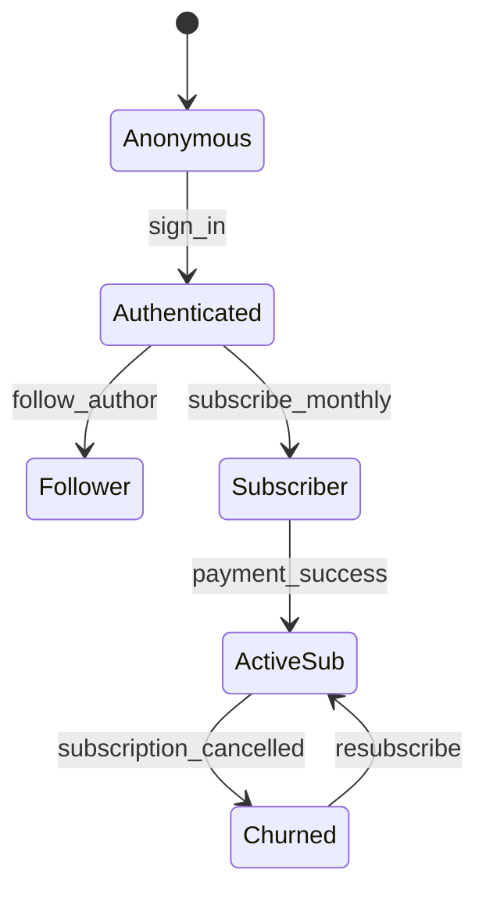

# Tyrian Trade — Полная UX-спецификация
## Социальная сеть для трейдеров с монетизацией

**Версия:** 2.0  
**Дата:** 2025  
**Бренд:** Tyrian Trade  
**Тема:** Dark theme, акценты: фиолетовый градиент (#A06AFF → #482090), зелёный (#2EBD85 bullish), красный (#FF2626 bearish), оранжевый (#FF6B35 hot)

---

## 1. Executive Summary

1. **Разделение фильтров**: Type (вид контента) и Topic (тематика) теперь ортогональны — устранён конфликт табов и категорий
2. **Монетизация**: три механики (подписка на автора, разовая покупка поста, донаты) с мгновенной разблокировкой
3. **Приватность**: четыре уровня аудитории (Everyone, Followers-only, Subscribers-only, One-off purchase)
4. **Following feed**: новый режим ленты "только от подпис��к" — улучшенная персонализация
5. **Hot score**: формула популярности с экспоненциальным затуханием по времени
6. **Новые посты**: WebSocket + debounce для реалтайм-уведомлений "X new posts available"
7. **Виджеты**: унификация, добавлены профильные (Author Activity, Top Tickers, Earnings для владельца)
8. **Gating check**: точная логика `isAuthor ∨ isSubscriber ∨ hasPurchase ∨ (FollowersOnly ∧ isFollower)`
9. **Профиль own/other**: чёткое разделение UI, subscriber badges, кнопка Subscribe рядом с Follow
10. **Pinned post**: только на вкладке Tweets, индикатор булавки, сохраняется сверху
11. **Replies**: визуальный индикатор "Replying to @user", открытие треда при клике
12. **Автосейв черновика**: композер сохраняет при закрытии, восстанавливает при открытии
13. **API-ready**: схемы данных и контракты подготовлены для backend, сейчас работают на моках
14. **Аналитика**: 15+ ��обытий для трекинга (post_create, subscribe, unlock, donate, filter_apply...)
15. **A11y + адаптив**: ARIA-роли, фокусы, контраст, брейкпоинты (mobile <640px, tablet <1024px, desktop ≥1024px)

---

## 2. Информационная архитектура

### 2.1. Карта экранов

```
/
├── /feed (Market Stream)
│   ├── Табы: All, Ideas, Opinions, Analytics, Soft, Liked, Following (NEW)
│   ├── Фильтры: Type, Topic, Market, Price, Period
│   ├── Сортировка: Hot / Recent
│   ├── Лента постов (с gating)
│   └── Правая панель: виджеты
│
├── /profile-page (Own profile)
│   ├── Hero + Edit button
│   ├── Табы: Tweets, Tweets & replies, Media, Likes
│   ├── Лента постов автора
│   ├── Earnings widget (только владелец)
│   └── Правая панель: профильные виджеты
│
├── /other-profile/:username (Other user)
│   ├── Hero + Follow/Subscribe buttons
│   ├── Те же табы
│   ├── Лента публичных/доступных постов
│   └── Правая панель: виджеты
│
└── /post/:id (Detail view)
    ├── Полный пост + тред комментариев
    ├── Gating check (если платный)
    └── Платёжные флоу (unlock/subscribe)
```

### 2.2. Состояния пользователя



---

## 3. User Flows

### 3.1. Публикация поста

```
Пользователь → Quick Composer (клик)
  → Advanced Composer (модал)
    → Вводит текст, добавляет медиа/код
    → Выбирает сентимент (Bullish/Bearish/Neutral)
    → Выбирает Type (Idea/Opinion/Analysis/Signal/Code/Media)
    → Выбирает Topic (News/Education/Macro/On-chain...)
    → Выбирает аудиторию:
      - Everyone (публично)
      - Followers-only
      - Subscribers-only
      - One-off purchase ($X)
    → Нажимает "Publish"
      → [Автосейв черновика при закры��ии модала]
      → POST /posts → 201 Created
      → Модал закрывается
      → Пост появляется в ленте (optimistic update)
```

### 3.2. Покупка/подписка → разблокировка

```
Анонимный/Follower → Видит GatedContent
  → Кликает "Unlock for $9"
    → Модал оплаты (Stripe/PayPal)
    → Вводит данные карты
    → POST /purchases → { postId, userId }
      → 200 OK → { accessGranted: true }
      → [Optimistic unlock — пост разблокируется мгновенно]
      → Обновление hasOneOffPurchase(post) → true
      → GatedContent скрывается, контент показывается

ИЛИ

  → Кликает "Subscribe $29/mo"
    → Модал подписки
    → POST /subscriptions → { authorId, plan: "monthly" }
      → 200 OK → { subscription: {...}, status: "active" }
      → [Optimistic unlock всех постов автора]
      → isSubscriber(author) → true
      → Бейдж "Subscriber" появляется у пользователя
```

### 3.3. Донат (Tip)

```
Пользователь на профиле → Видит кнопку "Send Tip"
  → Кликает → Модал с выбором суммы ($5 / $10 / $25 / Custom)
  → Вводит сумму + сообщение (опционально)
  → POST /tips → { authorId, amount, message }
    → 200 OK → { tipId, status: "success" }
    → Уведомление автору "You received $10 tip from @user"
    → Toast: "Tip sent successfully"
```

### 3.4. Follow → отображение везде

```
Пользователь → Кликает "Follow" (в виджете/профиле/посте)
  → Optimistic update: Follow → Following
  → POST /follows → { targetUserId }
    → 200 OK → { following: true }
    → Счётчик Followers у автора +1
    → Обновление состояния во всех компонентах:
      - Кнопка в профиле
      - Кнопка в виджете Suggested Profiles
      - Кнопка в виджете Top Authors
      - Бейдж "Following" в постах автора
```

---

## 4. UI Спецификация

### 4.1. /feed (Market Stream)

#### Композер

**Quick Composer**:
- Чёрная карточка с зелёной рамкой (`border-widget-border`)
- Плейсхолдер: "Что у вас на уме?"
- При фокусе → открывает Advanced Composer

**Advanced Composer (модал)**:
- Полноэкранный на mobile, центрированный на desktop
- Разделы:
  1. **Текст**: Textarea с автоувеличением высоты, макс 2000 символов, счётчик
  2. **Медиа**: Drag&drop или кнопка Upload (изображения до 10MB, видео до 100MB)
  3. **Код**: Кнопка `</>` → вставка блока с выбором языка (JS/TS/Python/Go...)
  4. **Сентимент**: Три кнопки-toggle: Bullish (зелёный), Bearish (красный), Neutral (серый)
  5. **Type**: Dropdown: Idea, Opinion, Analysis, Signal, Code, Media
  6. **Topic**: Dropdown: News, Education, Macro, On-chain, Code, Video, Signal
  7. **Аудитория**: Radio buttons:
     - Everyone (публично)
     - Followers-only (только подписчики)
     - Subscribers-only (только платные подписчики)
     - One-off purchase $X (указать цену)
  8. **Футер**: Кнопки "Cancel" (серая) и "Publish" (фиолетовый градиент)

**Автосейв**:
- При каждом изменении (debounce 500ms) → `localStorage.setItem('draft', data)`
- При закрытии модала без публикации → сохраняет черновик
- При открытии → проверяет `localStorage.draft` и восстанавливает

#### Табы (sticky)

```
┌─────────────────────────────────────────────────────────────────┐
│ [All] [Ideas] [Opinions] [Analytics] [Soft] [Liked] [Following]│ ← sticky при скролле
└─────────────────────────────────────────────────────────────────┘
```

- **All**: все типы постов
- **Ideas**: Type = Idea
- **Opinions**: Type = Opinion
- **Analytics**: Type = Analysis
- **Soft**: Type = Code
- **Liked**: посты, которые пользователь лайкнул
- **Following** (NEW): посты только от авторов, на которых подписан

Активный таб: фиолетовый градиент `from-[#A06AFF] to-[#482090]`, белый текст  
Неактивный: серый `text-[#9CA3AF]`, hover → белый + полупрозрачный градиент

#### Фильтры

**Ортогональные оси**:

1. **Topic** (выпадающий список):
   - All, News, Education, Analysis, Macro, On-chain, Code, Video, Signal
   - Иконки у каждой категории
   - Активная: фиолетовая рамка

2. **Market** (выпадающий список):
   - All, Crypto, Stocks, Forex, Futures, Commodities

3. **Price** (выпадающий список):
   - All, Free, Paid (one-off), Subscription

4. **Period** (выпадающий список):
   - All time, Today, 7d, 30d, YTD, Custom (date picker)

**Справа**:

5. **Сортировка**: Toggle Hot / Recent
   - Hot: оранжевый градиент + иконка огня
   - Recent: синий градиент + иконка часов

**Индикаторы активных фильтров**:
- Над лентой: "Filtering: Topic=News, Market=Crypto, Ticker=$BTC [× сбросить]"
- При пустой выдаче: "No posts found. [Reset filters]"

**Выбранный тикер**:
- При клике на Trending Tickers → добавляется фильтр `ticker=$BTC`
- Показывается бейдж "Filtering: $BTC ×" (клик → сброс)
- Сохраняется при смене табов (кроме перехода в /profile)

#### Карточка поста

**Структура**:

```
┌────────────────────────────────────────────────────────────┐
│ [Аватар] [Имя ✓] @handle · 2h                        [···]│
│          [Bullish ↑] [$BTC] [Long] [Idea]                 │
│                                                            │
│ Текст поста с кликабельными ссылками и @mentions...       │
│                                                            │
│ #hashtag #trading #crypto  ← новая строка, синие          │
│                                                            │
│ [Изображение/Видео, если есть]                            │
│                                                            │
│ ┌─ Для сигналов ─────────────────────────┐                │
│ │ Accuracy 82% · 50 signals / 90d         │                │
│ │ Entry: $42,500 | Stop: $41,000 | TP: $45,000           │
│ └─────────────────────��────────────────────┘                │
│                                                            │
│ ─────────────────���───────────────────────────────────────  │
│ [💬 24] [🔁 11.2K] [❤️ 36.3K] [📊 97.4K] [🔖]            │
└────────────────────────────────────────────────────────────┘
```

**Бейджи**:
- **Sentiment**: `Bullish ↑` (зелёный), `Bearish ↓` (красный), рамка + иконка
- **Ticker**: `$BTC` (фиолетовый градиент, тень)
- **Direction**: `Long` (зелёный градиент), `Short` (красный градиент)
- **Type**: `Idea` (голубой), `Opinion` (красный), `Analytics` (оранжевый), `Soft` (синий), `Video` (розовый)

**Платный контент (GatedContent)**:

```
┌────────────────────────────────────────────────────────────┐
│                   [Размытый фон с логотипом]               │
│                                                            │
│                      [🔒] или [👑]                         │
│                                                            │
│                   Paid Content                             │
│     Unlock this post for $9 or subscribe to               │
│     @author to access all paid posts                       │
│                                                            │
│  [Unlock for $9]     [Subscribe $29/mo]                   │
│                                                            │
│  Subscription gives access to all paid posts               │
│  and new publications                                      │
└────────────────────────────────────────────────────────────┘
```

**Варианты заголовков**:
- `Paid Content` (one-off)
- `Subscribers Only` (subscription)
- `Premium Content` (premium tier)
- `Followers Only` (followers-only)

**Кнопки**:
- One-off: "Unlock for $X" (фиолетовый градиент)
- Subscription: "Subscribe $Y/mo" (outline, фиолетовая рамка)
- После покупки: кнопки скрываются, контент разблокируется мгновенно

#### Баннер новых постов

```
┌──────���───────────────────────────────────┐
│  5 new posts available  [фиол. градиент] │ ← sticky вверху ленты
└──────────────────────────────────────────┘
```

- Появляется при получении новых постов (WebSocket event `new_posts`)
- Клик → вставляет новые посты в начало ленты (fade-in анимация)
- Пропадает после загрузки

#### Правая панель (desktop only, ≥1024px)

**Список виджетов (сверху вниз)**:

1. **Fear & Greed Index**
   - Круговой индикатор 0-100
   - Цвет: красный (<25) → жёлтый (25-75) → зелёный (>75)
   - Метка: Extreme Fear / Fear / Neutral / Greed / Extreme Greed

2. **Community Sentiment**
   - % бычьих голосов (зелёная шкала)
   - Число голосов: "1.9M votes"
   - Источник: агрегация sentiment из постов + голосования

3. **Trending Tickers**
   - Список топ-10 активов
   - Тикер, цена, изменение в %
   - Цве��: зелёный (рост), красный (падение)
   - Клик → фильтр ленты `ticker=$BTC`, подсветка активного

4. **Suggested Profiles**
   - 5 рекомендуемых пользователей
   - Аватар, имя, @handle, кнопка Follow
   - Логика: ML-рекомендации (mock: случайные)

5. **News / Trending Topics**
   - Список топ-5 новостей/тем
   - Заголовок, краткое описание, категория
   - Клик → фильтр `topic=News` или переход на /post/:id

6. **Top Authors**
   - Топ-5 авторов по engagement (likes + comments + views)
   - Аватар, имя, @handle, статистика (followers, posts за 7д)
   - Кнопка Follow/Following с toggle

**Объединение дублей**:
- Убираем "Follow Recommendations" (дубль Suggested Profiles)
- Suggested Profiles → ML-персонализация
- Top Authors → сортировка по engagement

---

### 4.2. /profile-page (own) & /other-profile/:username

#### Sticky-шапка

```
┌───────────────────────────────────────────────────��────────┐
│ [←] Tyrian Trade ✓                               1,480 post│ ← sticky
└────────────────────────────────────────────────────────────┘
```

- **Mobile**: mini-аватар слева от имени (круглый 32px)
- **Desktop**: без аватара (он есть в Hero)
- **Кнопка Назад**: `history.back()`, fallback → `/feed`

#### Hero

**Обложка**:
- 200px высота (desktop), 120px (mobile)
- Изображение или градиент `from-[#141923] to-[#0B0E13]`
- Скруглённые углы `rounded-3xl`

**Аватар**:
- 132px (desktop), 80px (mobile)
- Круглый, border 4px `border-[#0B0E13]`
- Перекрывает низ обложки (`-mt-16`)

**Кнопки** (справа):

**Own profile**:
- `[···]` — меню (Share, Copy link, Settings)
- `[✉️]` — Message (скрыта для себя)
- `[Edit profile]` — открывает модал редактирования

**Other profile**:
- `[···]` — меню (Share, Copy link, Block, Report)
- `[✉️]` — Message (открывает /messages/:username)
- `[Follow]` / `[Following]` — toggle
- `[Subscribe $29/mo]` — кнопка подписки (справа от Follow)

**Subscriber badge**:
- Если пользователь подписан на автора → бейдж "Subscriber" (фиолетовый, рядом с именем)

#### Информация

**Имя + username**:
- **Имя**: `text-xl font-bold text-white`
- **Галочка** ✓: `text-[#A06AFF]` (если verified)
- **@username**: `text-[#8B98A5]`

**Био**:
- Белый текст, ссылки кликабельны и подсвечены `text-[#A06AFF]`

**Метаданные** (иконки + текст):
- Tier badge: `[🛡️] Tier 4`
- Локация: `[📍] Dubai, UAE`
- Вебсайт: `[🔗] tyrian.trade` (кликабельно)
- Joined: `[📅] Joined Март 2021`

**Статистика**:
- **Following**: `312` (жирно) + "Following" (серый)
- **Followers**: `28.4K` (жирно) + "Followers" (серый)
- В одну строку, отступ между ними

**Дополнительно** (для чужого профиля):
- "Not followed by anyone you are following" (серый, мелкий)
- ИЛИ "Followed by @user1, @user2 and 5 others" (если есть общие)

#### Табы (sticky)

```
┌───────────────────────────────────────────────────────┐
│ Tweets | Tweets & replies | Media | Likes             │ ← sticky
└───────────────────────────────────────────────────────┘
```

- **Tweets**: только оригинальные посты
- **Tweets & replies**: посты + ответы (индикатор "Replying to @user")
- **Media**: только посты с изображениями/видео
- **Likes**: лайкнутые посты (для own profile видно всё, для other — только публичные)

**Активный таб**:
- Белый текст, фиолетовая линия снизу (3px, `bg-[#A06AFF]`)

**Неактивный**:
- Серый `text-[#777]`, hover → `bg-[#111]`

#### Pinned post

- Только на вкладке "Tweets"
- Иконка булавки 📌 сверху поста
- Всегда первый, даже если старый

#### Replies

- В "Tweets & replies" каждый reply имеет индикатор:

```
┌────────────────────────────────────────────┐
│ Replying to @cryptowhale                   │ ← серый текст, мелкий
│ [Аватар] [Имя] @handle · 1h                │
│ Текст ответа...                            │
└────────────────────────────────────────────┘
```

- Клик на "Replying to" → переход к родительскому посту (открытие треда)

#### Earnings Widget (только для владельца)

```
┌────────────────────────────────────────────┐
│ 💰 Your Earnings (Last 30 days)            │
│                                            │
│ MRR: $1,240                                │
│ ARPU: $24.80                               │
│ Active subscribers: 50                     │
│                                            │
│ Top posts by revenue:                      │
│ 1. Signal post #123   $180                │
│ 2. Analysis post #456 $120                │
│ 3. Idea post #789     $95                 │
└────────────────────────────────────────────┘
```

- Только на "моём профиле" (/profile-page)
- В правой панели, вверху
- Данные: MRR (monthly recurring revenue), ARPU (average revenue per user), число активных сабов, топ-3 поста по выручке

#### Правая панель (профильные виджеты)

**Для own profile**:
1. **Earnings Widget** (см. выше)
2. **Author Activity (Last 7 days)**:
   - Posts: 12
   - Likes received: 340
   - Comments: 68
   - New followers: 15
3. **Top Tickers of this author**:
   - $BTC (45 posts)
   - $ETH (28 posts)
   - $SOL (12 posts)
   - Клик → фильтр постов автора по тикеру

**Для other profile**:
1. **Fear & Greed** (стандартный)
2. **Community Sentiment** (стандартный)
3. **Author Activity** (Last 7 days)
4. **Top Tickers**
5. **Suggested Profiles** (кроме текущего автора)

**Behaviour Trending Tickers на профиле**:
- Клик → фильтрует посты **этого автора** по тикеру (не переход в /feed)
- Показывается бейдж "Showing $BTC posts ×" над лентой

---

## 5. Фильтры и сортиро��ки

### 5.1. Таблица пересечений

| Таб        | Type    | Topic   | Результат                                              |
|------------|---------|---------|--------------------------------------------------------|
| All        | All     | All     | Все посты                                              |
| Ideas      | Idea    | All     | Только Ideas, любая тематика                           |
| Ideas      | Idea    | Video   | Ideas с видео (если есть видео в посте)                |
| Analytics  | Analysis| Macro   | Analysis на тему Macro                                 |
| Soft       | Code    | Education | Образовательные посты с кодом                        |
| Following  | All     | News    | Новости от авторов, на которых подписан                |
| Liked      | All     | All     | Все лайкнутые посты (игнорирует Type/Topic фильтры)    |

### 5.2. Правила пересечения

1. **Таб → Type**: Таб определяет Type (Ideas → Type=Idea, кроме All, Liked, Following)
2. **Topic**: независим от таба, применяется поверх
3. **Market, Price, Period**: ортогональны, применяются всегда
4. **Ticker**: если выбран → добавляет фильтр `post.ticker === selectedTicker`
5. **Пустая выдача**: "No posts found. Try resetting filters or changing tabs."

### 5.3. Индикаторы активных фильтров

```
┌──────────────────────────────────────────────────────────┐
│ Filtering: Topic=News, Market=Crypto, Ticker=$BTC   [× Reset] │
└──────────────────────────────────────────────────────────┘
```

- Над лентой, серый фон
- Кнопка × → сброс всех фильтров (кроме таба)

### 5.4. Hot Score (формула)

```typescript
function calculateHotScore(post: Post, now: Date): number {
  const ageHours = (now.getTime() - new Date(post.timestamp).getTime()) / (1000 * 60 * 60);
  const decay = Math.exp(-ageHours / 24); // затухание за 24ч

  const likesWeight = 1;
  const commentsWeight = 3; // комменты ценнее
  const repostsWeight = 2;
  const viewsWeight = 0.01; // просмотры меньше влияют

  const engagement =
    post.likes * likesWeight +
    post.comments * commentsWeight +
    post.reposts * repostsWeight +
    post.views * viewsWeight;

  return engagement * decay;
}
```

**Параметры**:
- `decay`: экспоненциальное затухание, половина за 24 часа
- `likesWeight`: 1
- `commentsWeight`: 3 (больше engagement)
- `repostsWeight`: 2
- `viewsWeight`: 0.01

**Сортировка**:
- Hot: `posts.sort((a, b) => hotScore(b) - hotScore(a))`
- Recent: `posts.sort((a, b) => new Date(b.timestamp) - new Date(a.timestamp))`

---

## 6. Монетизация и приватность

### 6.1. Модель аудитории поста

**4 уровня**:

1. **Everyone** (публично):
   - Доступен всем (анонимам, залогиненным, подписчикам)
   - `post.accessLevel = "public"`

2. **Followers-only**:
   - Только фолловеры автора
   - `post.accessLevel = "followers"`
   - Check: `isFollower(userId, post.author.id)`

3. **Subscribers-only**:
   - Только платные подписчики
   - `post.accessLevel = "subscribers"`
   - Check: `hasActiveSubscription(userId, post.author.id)`

4. **One-off purchase**:
   - Разовая покупка за $X
   - `post.accessLevel = "paid"`, `post.price = 9`
   - Check: `hasPurchased(userId, post.id) || hasActiveSubscription(userId, post.author.id)`

### 6.2. Gating Check (точная логика)

```typescript
function canAccessPost(post: Post, viewer: User | null): boolean {
  // 1. Автор всегда видит
  if (viewer && viewer.id === post.author.id) return true;

  // 2. Публичный пост
  if (post.accessLevel === "public") return true;

  // 3. Анонимы не видят приватное
  if (!viewer) return false;

  // 4. Followers-only
  if (post.accessLevel === "followers") {
    return isFollower(viewer.id, post.author.id);
  }

  // 5. Subscribers-only
  if (post.accessLevel === "subscribers") {
    return hasActiveSubscription(viewer.id, post.author.id);
  }

  // 6. Paid (one-off)
  if (post.accessLevel === "paid") {
    return (
      hasPurchased(viewer.id, post.id) ||
      hasActiveSubscription(viewer.id, post.author.id)
    );
  }

  return false;
}
```

**Примеры**:
- Анонимный пользователь → видит только `public`
- Залогиненный фолловер → видит `public` + `followers`
- Платный подписчик → видит `public` + `followers` + `subscribers` + `paid` (все посты автора)
- Купивший разово → видит `public` + `paid` (конкретный пост)

### 6.3. GatedContent UI

**Варианты заголовков и опи��аний**:

| AccessLevel   | Title              | Description                                                                     | Buttons                      |
|---------------|--------------------|---------------------------------------------------------------------------------|------------------------------|
| `paid`        | Paid Content       | Unlock this post for $9 or subscribe to @author to access all paid posts       | [Unlock $9] [Subscribe $29/mo] |
| `subscribers` | Subscribers Only   | Subscribe to @author for $29/mo to access this content                          | [Subscribe $29/mo]           |
| `premium`     | Premium Content    | Get premium subscription for $49/mo for exclusive content                       | [Subscribe $49/mo]           |
| `followers`   | Followers Only     | Follow @author to see this post                                                 | [Follow]                     |

**Иконки**:
- `paid`, `subscribers`, `followers`: 🔒 Lock
- `premium`: 👑 Crown (золотой)

**Мгновенная разблокировка**:
- После успешной оплаты → `POST /purchases` → 200 OK
- Optimistic update: `hasAccess = true`, GatedContent скрывается
- Контент появляется с fade-in анимацией (200ms)

### 6.4. Платёжные флоу

#### Unlock (one-off)

```
Клик "Unlock for $9"
  → Модал оплаты
    → Выбор метода: Card / PayPal
    → Ввод данных
    → POST /purchases { postId, amount: 9, method: "card" }
      → [Processing...] (спиннер)
      → 200 OK { purchaseId, status: "success" }
        → Toast: "Post unlocked!"
        → Модал закрывается
        → GatedContent → Post content (fade-in)
      → 402 Payment Required { error: "insufficient_funds" }
        → Toast: "Payment failed: insufficient funds"
      → 500 Error
        → Toast: "Payment failed. Try again later"
```

**Idempotency**:
- `POST /purchases` с `idempotencyKey` (client UUID)
- Если повторный запрос с тем же ключом → возвращает тот же `purchaseId`, статус 200

**Охрана от повторной покупки**:
- Перед показом кнопки Unlock → проверка `hasPurchased(userId, postId)`
- Если уже купил → не показываем GatedContent, сразу контент

#### Subscribe

```
Клик "Subscribe $29/mo"
  → Модал подписки
    → План: Monthly $29/mo ИЛИ Yearly $290/yr (save 17%)
    �� Выбор метода: Card / PayPal
    → Ввод данных (если нет сохранённых)
    → POST /subscriptions { authorId, plan: "monthly", method: "card" }
      → [Processing...] (спиннер)
      → 200 OK { subscriptionId, status: "active", nextBillingDate }
        → Toast: "Subscribed to @author!"
        → Модал закрывается
        → Все посты автора разблокируются
        → Бейдж "Subscriber" появляется у пользователя
        → Кнопка "Subscribe" → "Manage Subscription"
      → 402 Payment Required { error: "card_declined" }
        → Toast: "Payment failed: card declined"
      → 409 Conflict { error: "already_subscribed" }
        → Toast: "You are already subscribed"
```

**Отмена подписки**:
- Кнопка "Manage Subscription" → модал
  → "Cancel Subscription" → confirmation
  → DELETE /subscriptions/:id
    → 200 OK { status: "cancelled", accessUntil: "2025-02-01" }
    → Toast: "Subscription cancelled. Access until Feb 1"
    → Доступ сохраняется до конца оплаченного периода

#### Donate (Tip)

```
Клик "Send Tip" (на профиле)
  ��� Модал
    → Выбор суммы: [$5] [$10] [$25] [Custom]
    → Поле сообщения (опционально, макс 200 символов)
    → POST /tips { authorId, amount: 10, message: "Great analysis!" }
      → [Processing...] (спиннер)
      → 200 OK { tipId, status: "success" }
        → Toast: "Tip sent to @author!"
        → Модал закрывается
        → Уведомление автору (in-app + email)
```

### 6.5. Earnings Widget (только владелец профиля)

**Данные**:
- **MRR** (Monthly Recurring Revenue): сумма всех активных подписок
- **ARPU** (Average Revenue Per User): MRR / число активных сабов
- **Active subscribers**: число пользователей с активной подпиской
- **Top posts by revenue**: топ-3 поста по сумме покупок (one-off) за 30 дней

**Пример**:

```json
{
  "mrr": 1240,
  "arpu": 24.8,
  "activeSubscribers": 50,
  "topPostsByRevenue": [
    { "postId": "123", "title": "Signal post...", "revenue": 180 },
    { "postId": "456", "title": "Analysis...", "revenue": 120 },
    { "postId": "789", "title": "Idea...", "revenue": 95 }
  ]
}
```

**API**: `GET /earnings?period=30d` (только для `userId === viewerId`)

---

## 7. Схемы данных + API контракты

### 7.1. TypeScript Interfaces

```typescript
// ============ USER & PROFILE ============

interface User {
  id: string;
  username: string;
  email: string;
  createdAt: string; // ISO 8601
  role: "user" | "admin" | "moderator";
}

interface Profile {
  userId: string;
  name: string;
  bio: string;
  avatar: string; // URL
  cover?: string; // URL
  location?: string;
  website?: string;
  tier: 1 | 2 | 3 | 4;
  verified: boolean;
  joinedAt: string; // ISO 8601
  stats: ProfileStats;
}

interface ProfileStats {
  posts: number;
  followers: number;
  following: number;
  likes: number; // всего получено лайков
}

// ============ POST ============

type PostType = "idea" | "opinion" | "analysis" | "signal" | "code" | "media";
type PostTopic = "news" | "education" | "macro" | "onchain" | "code" | "video" | "signal";
type AccessLevel = "public" | "followers" | "subscribers" | "paid";
type SentimentType = "bullish" | "bearish" | "neutral";
type MarketType = "crypto" | "stocks" | "forex" | "commodities" | "indices";
type DirectionType = "long" | "short";

interface Post {
  id: string;
  authorId: string;
  author: Profile; // денормализованный для удобства
  timestamp: string; // ISO 8601
  type: PostType;
  topic: PostTopic;
  text: string;
  sentiment?: SentimentType;
  market?: MarketType;
  accessLevel: AccessLevel;
  price?: number; // для paid
  ticker?: string; // $BTC
  direction?: DirectionType; // для signal
  timeframe?: string; // 1h, 4h, 1d
  risk?: "low" | "medium" | "high";
  accuracy?: number; // % для signal
  sampleSize?: number; // число сигналов
  entry?: string;
  stopLoss?: string;
  takeProfit?: string;
  mediaUrl?: string;
  codeSnippet?: string;
  language?: string; // для code
  tags?: string[]; // хештеги без #
  isPinned: boolean;
  stats: PostStats;
}

interface PostStats {
  likes: number;
  comments: number;
  reposts: number;
  views: number;
  purchases?: number; // для paid
}

// ============ SUBSCRIPTION ============

interface SubscriptionPlan {
  id: string;
  authorId: string;
  priceMonthly: number;
  priceYearly?: number;
  features: string[]; // "All paid posts", "Exclusive signals"...
}

interface Subscription {
  id: string;
  userId: string;
  authorId: string;
  planId: string;
  status: "active" | "cancelled" | "expired";
  startDate: string;
  nextBillingDate?: string;
  cancelledAt?: string;
}

// ============ PURCHASE ============

interface Purchase {
  id: string;
  userId: string;
  postId: string;
  amount: number;
  method: "card" | "paypal";
  status: "pending" | "success" | "failed";
  purchasedAt: string;
  idempotencyKey: string;
}

// ============ FOLLOW ============

interface Follow {
  id: string;
  followerId: string; // кто подписался
  followeeId: string; // на кого
  createdAt: string;
}

// ============ REACTION ============

interface Like {
  id: string;
  userId: string;
  postId: string;
  createdAt: string;
}

interface Repost {
  id: string;
  userId: string;
  postId: string;
  createdAt: string;
}

interface Comment {
  id: string;
  userId: string;
  postId: string;
  parentId?: string; // для threaded comments
  text: string;
  createdAt: string;
}

interface View {
  id: string;
  userId?: string; // null для анонимов
  postId: string;
  viewedAt: string;
}

// ============ TICKER & SENTIMENT ============

interface Ticker {
  symbol: string; // BTC, ETH
  name: string; // Bitcoin, Ethereum
  price: number;
  change24h: number; // %
  sentiment: "bullish" | "bearish" | "neutral";
}

interface SentimentVote {
  id: string;
  userId: string;
  ticker: string;
  sentiment: "bullish" | "bearish";
  createdAt: string;
}

// ============ TIP ============

interface Tip {
  id: string;
  senderId: string;
  recipientId: string;
  amount: number;
  message?: string;
  status: "pending" | "success" | "failed";
  createdAt: string;
}
```

### 7.2. ER-диаграмма (упрощённая)

```
User (1) ──< (M) Follow >── (M) User
  │
  └─── (1) Profile
  │
  └─── (M) Post
         │
         ├─── (M) Like
         ├─── (M) Comment
         ├─── (M) Repost
         ├─── (M) View
         └─── (M) Purchase

User (1) ──< (M) Subscription >── (1) SubscriptionPlan ── (1) User (author)

User (1) ──< (M) Tip >── (1) User (recipient)
```

### 7.3. API контракты (REST)

#### GET /feed

**Query params**:
```
?tab=all|ideas|opinions|analytics|soft|liked|following
&type=all|idea|opinion|analysis|signal|code|media
&topic=all|news|education|macro|onchain|code|video|signal
&market=all|crypto|stocks|forex|futures|commodities
&price=all|free|paid|subscription
&period=all|today|7d|30d|ytd|custom
&sort=hot|recent
&ticker=$BTC (optional)
&page=1
&limit=20
```

**Response** (200 OK):
```json
{
  "posts": [
    {
      "id": "post-123",
      "authorId": "user-456",
      "author": {
        "userId": "user-456",
        "name": "Crypto Whale",
        "username": "cryptowhale",
        "avatar": "https://...",
        "verified": true,
        "tier": 4
      },
      "timestamp": "2025-01-15T14:30:00Z",
      "type": "idea",
      "topic": "analysis",
      "text": "BTC looks bullish on 4h chart...",
      "sentiment": "bullish",
      "market": "crypto",
      "accessLevel": "paid",
      "price": 9,
      "ticker": "$BTC",
      "tags": ["btc", "trading", "crypto"],
      "isPinned": false,
      "stats": {
        "likes": 340,
        "comments": 68,
        "reposts": 112,
        "views": 4500,
        "purchases": 15
      }
    }
  ],
  "pagination": {
    "page": 1,
    "limit": 20,
    "total": 1480,
    "hasMore": true
  },
  "meta": {
    "hotScoreCalculated": true,
    "filtersApplied": ["topic=analysis", "ticker=$BTC"]
  }
}
```

**Errors**:
- `400 Bad Request` — invalid query params
- `401 Unauthorized` — требуется авторизация (для `tab=liked|following`)

---

#### GET /profiles/:id

**Response** (200 OK):
```json
{
  "userId": "user-456",
  "name": "Crypto Whale",
  "username": "cryptowhale",
  "bio": "Трейдер с 10-летним опытом...",
  "avatar": "https://...",
  "cover": "https://...",
  "location": "Dubai, UAE",
  "website": "https://cryptowhale.com",
  "tier": 4,
  "verified": true,
  "joinedAt": "2021-03-15T00:00:00Z",
  "stats": {
    "posts": 1480,
    "followers": 28400,
    "following": 312,
    "likes": 96200
  },
  "subscriptionPlan": {
    "id": "plan-789",
    "priceMonthly": 29,
    "priceYearly": 290,
    "features": ["All paid posts", "Exclusive signals", "Private chat"]
  },
  "pinnedPostId": "post-123"
}
```

---

#### GET /profiles/:id/posts

**Query params**:
```
?tab=tweets|replies|media|likes
&ticker=$BTC (optional, фильтр по тикеру)
&page=1
&limit=20
```

**Response** (200 OK): аналогично `/feed`, но только посты автора.

---

#### POST /posts

**Request**:
```json
{
  "type": "idea",
  "topic": "analysis",
  "text": "BTC looks bullish...",
  "sentiment": "bullish",
  "market": "crypto",
  "accessLevel": "paid",
  "price": 9,
  "ticker": "$BTC",
  "tags": ["btc", "trading"],
  "mediaUrl": "https://...",
  "codeSnippet": "const x = 1;",
  "language": "javascript"
}
```

**Response** (201 Created):
```json
{
  "id": "post-999",
  "authorId": "user-456",
  "timestamp": "2025-01-15T15:00:00Z",
  ...
}
```

**Errors**:
- `400 Bad Request` — invalid data (напр. price без accessLevel=paid)
- `401 Unauthorized` — не авторизован
- `413 Payload Too Large` — медиа >10MB

---

#### POST /subscriptions

**Request**:
```json
{
  "authorId": "user-456",
  "planId": "plan-789",
  "period": "monthly",
  "method": "card",
  "paymentMethodId": "pm_123" // Stripe payment method
}
```

**Response** (200 OK):
```json
{
  "subscriptionId": "sub-999",
  "status": "active",
  "startDate": "2025-01-15T15:00:00Z",
  "nextBillingDate": "2025-02-15T15:00:00Z",
  "amount": 29
}
```

**Errors**:
- `400 Bad Request` — invalid data
- `402 Payment Required` — `{ "error": "card_declined", "message": "Your card was declined" }`
- `409 Conflict` — `{ "error": "already_subscribed" }`

---

#### POST /purchases

**Request**:
```json
{
  "postId": "post-123",
  "amount": 9,
  "method": "card",
  "paymentMethodId": "pm_123",
  "idempotencyKey": "uuid-client-generated"
}
```

**Response** (200 OK):
```json
{
  "purchaseId": "pur-999",
  "status": "success",
  "postId": "post-123",
  "amount": 9,
  "purchasedAt": "2025-01-15T15:00:00Z"
}
```

**Errors**:
- `402 Payment Required` — `{ "error": "insufficient_funds" }`
- `409 Conflict` — `{ "error": "already_purchased" }` (idempotency)

---

#### GET /access/check

**Query params**: `?postId=post-123`

**Response** (200 OK):
```json
{
  "canAccess": true,
  "reason": "subscribed" // или "purchased", "public", "author", "follower"
}
```

---

#### POST /follow

**Request**:
```json
{
  "targetUserId": "user-456"
}
```

**Response** (200 OK):
```json
{
  "followId": "fol-999",
  "following": true
}
```

**Errors**:
- `409 Conflict` — `{ "error": "already_following" }`

---

#### DELETE /follow/:targetUserId

**Response** (200 OK):
```json
{
  "following": false
}
```

---

#### GET /widgets/fear-greed

**Response** (200 OK):
```json
{
  "score": 32,
  "label": "Fear",
  "updatedAt": "2025-01-15T15:00:00Z"
}
```

---

#### GET /widgets/trending

**Response** (200 OK):
```json
{
  "tickers": [
    { "symbol": "BTC", "name": "Bitcoin", "price": 42500, "change24h": 3.2, "sentiment": "bullish" },
    { "symbol": "ETH", "name": "Ethereum", "price": 2250, "change24h": -1.5, "sentiment": "bearish" }
  ]
}
```

---

#### GET /widgets/sentiment

**Response** (200 OK):
```json
{
  "bullishPercent": 82,
  "votesCount": 1900000,
  "updatedAt": "2025-01-15T15:00:00Z"
}
```

---

#### GET /earnings

**Query params**: `?period=30d|90d|all`

**Response** (200 OK):
```json
{
  "mrr": 1240,
  "arpu": 24.8,
  "activeSubscribers": 50,
  "topPostsByRevenue": [
    { "postId": "post-123", "title": "Signal post...", "revenue": 180 },
    { "postId": "post-456", "title": "Analysis...", "revenue": 120 }
  ],
  "period": "30d"
}
```

**Errors**:
- `403 Forbidden` — не владелец профиля

---

## 8. Компонентная архитектура фронтенда

### 8.1. Диаграмма компонентов

```
App
├── ClientLayout
│   ├── Header (Navbar, Search, Avatar, Notifications)
│   ├── Sidebar (NewNavBar)
│   ├── MainContent
│   │   ├── /feed → FeedPage
│   │   │   ├── QuickComposer
│   │   │   ├── FeedTabs
│   │   │   ├── FeedFilters
│   │   │   ├── NewPostsBanner
│   │   │   └── PostsList
│   │   │       └── PostCard
│   │   │           ├── PostHeader
│   │   │           ��── PostBadges
│   │   │           ├── PostContent (или GatedContent)
│   │   │           └── PostFooter
│   │   │
│   │   ├── /profile-page → ProfilePage
│   │   │   ├── ProfileHero
│   │   │   ├── ProfileInfo
│   │   │   ├── ProfileTabs
│   │   │   └── PostsList (с pinned)
│   │   │
│   │   └── /other-profile/:username → OtherProfilePage
│   │
│   └── RightSidebar
│       ├── FearGreedWidget
│       ├── CommunitySentimentWidget
│       ├── TrendingTickersWidget
│       ├── SuggestedProfilesWidget
│       ├── NewsWidget
│       ├── TopAuthorsWidget
│       ├── EarningsWidget (только own profile)
│       └── AuthorActivityWidget
│
├── Modals
│   ├── AdvancedComposer
│   ├── PaymentModal (Unlock/Subscribe)
│   ├── TipModal
│   └── EditProfileModal
│
└── Providers
    ├── AuthProvider (current user)
    ├── WebSocketProvider (new posts)
    └── AnalyticsProvider (events tracking)
```

### 8.2. Ключевые хуки

```typescript
// useAuth.ts
function useAuth() {
  const [user, setUser] = useState<User | null>(null);
  const [loading, setLoading] = useState(true);

  useEffect(() => {
    // Check session from localStorage/cookies
    const token = localStorage.getItem("authToken");
    if (token) {
      fetch("/api/auth/me", { headers: { Authorization: `Bearer ${token}` } })
        .then(res => res.json())
        .then(setUser)
        .finally(() => setLoading(false));
    } else {
      setLoading(false);
    }
  }, []);

  const login = async (email: string, password: string) => {
    const res = await fetch("/api/auth/login", {
      method: "POST",
      body: JSON.stringify({ email, password }),
    });
    const data = await res.json();
    localStorage.setItem("authToken", data.token);
    setUser(data.user);
  };

  const logout = () => {
    localStorage.removeItem("authToken");
    setUser(null);
  };

  return { user, loading, login, logout };
}

// useGatingCheck.ts
function useGatingCheck(post: Post) {
  const { user } = useAuth();
  const [canAccess, setCanAccess] = useState(false);
  const [loading, setLoading] = useState(true);

  useEffect(() => {
    async function check() {
      if (!user) {
        setCanAccess(post.accessLevel === "public");
        setLoading(false);
        return;
      }

      // Client-side check (можно кешировать)
      const hasAccess = await canAccessPost(post, user);
      setCanAccess(hasAccess);
      setLoading(false);
    }
    check();
  }, [post.id, user]);

  return { canAccess, loading };
}

async function canAccessPost(post: Post, user: User): Promise<boolean> {
  // 1. Автор
  if (user.id === post.authorId) return true;

  // 2. Public
  if (post.accessLevel === "public") return true;

  // 3. Followers-only
  if (post.accessLevel === "followers") {
    const res = await fetch(`/api/follows/check?userId=${user.id}&targetId=${post.authorId}`);
    const { isFollowing } = await res.json();
    return isFollowing;
  }

  // 4. Subscribers-only
  if (post.accessLevel === "subscribers") {
    const res = await fetch(`/api/subscriptions/check?userId=${user.id}&authorId=${post.authorId}`);
    const { isSubscribed } = await res.json();
    return isSubscribed;
  }

  // 5. Paid
  if (post.accessLevel === "paid") {
    const [purchase, subscription] = await Promise.all([
      fetch(`/api/purchases/check?userId=${user.id}&postId=${post.id}`).then(r => r.json()),
      fetch(`/api/subscriptions/check?userId=${user.id}&authorId=${post.authorId}`).then(r => r.json()),
    ]);
    return purchase.hasPurchased || subscription.isSubscribed;
  }

  return false;
}

// useNewPosts.ts (WebSocket)
function useNewPosts(feedParams: FeedParams) {
  const [newPostsCount, setNewPostsCount] = useState(0);
  const [newPostsIds, setNewPostsIds] = useState<string[]>([]);

  useEffect(() => {
    const ws = new WebSocket("wss://api.tyrian.trade/feed");

    ws.onopen = () => {
      ws.send(JSON.stringify({ action: "subscribe", params: feedParams }));
    };

    ws.onmessage = (event) => {
      const data = JSON.parse(event.data);
      if (data.type === "new_post") {
        setNewPostsIds(prev => [...prev, data.postId]);
        setNewPostsCount(prev => prev + 1);
      }
    };

    return () => ws.close();
  }, [feedParams]);

  const loadNewPosts = useCallback(async () => {
    if (newPostsIds.length === 0) return [];
    const res = await fetch(`/api/posts?ids=${newPostsIds.join(",")}`);
    const posts = await res.json();
    setNewPostsCount(0);
    setNewPostsIds([]);
    return posts;
  }, [newPostsIds]);

  return { newPostsCount, loadNewPosts };
}

// useHotScore.ts
function useHotScore(posts: Post[], enabled: boolean) {
  return useMemo(() => {
    if (!enabled) return posts;
    const now = new Date();
    return [...posts].sort((a, b) => calculateHotScore(b, now) - calculateHotScore(a, now));
  }, [posts, enabled]);
}

function calculateHotScore(post: Post, now: Date): number {
  const ageHours = (now.getTime() - new Date(post.timestamp).getTime()) / (1000 * 60 * 60);
  const decay = Math.exp(-ageHours / 24);
  const engagement =
    post.stats.likes * 1 +
    post.stats.comments * 3 +
    post.stats.reposts * 2 +
    post.stats.views * 0.01;
  return engagement * decay;
}
```

### 8.3. Фрагменты кода

#### PostCard с GatedContent

```tsx
// PostCard.tsx
import { useGatingCheck } from "@/hooks/useGatingCheck";
import GatedContent from "./GatedContent";

interface PostCardProps {
  post: Post;
  onUnlock: (postId: string) => void;
  onSubscribe: (authorId: string) => void;
}

export default function PostCard({ post, onUnlock, onSubscribe }: PostCardProps) {
  const { canAccess, loading } = useGatingCheck(post);

  if (loading) {
    return <div className="animate-pulse bg-gray-800 rounded-xl h-64" />;
  }

  return (
    <article className="rounded-xl border border-widget-border bg-black p-6">
      <PostHeader author={post.author} timestamp={post.timestamp} />
      <PostBadges post={post} />

      {canAccess ? (
        <PostContent text={post.text} tags={post.tags} mediaUrl={post.mediaUrl} />
      ) : (
        <GatedContent
          accessLevel={post.accessLevel}
          postPrice={post.price}
          subscriptionPrice={post.author.subscriptionPlan?.priceMonthly}
          authorName={post.author.name}
          onUnlock={() => onUnlock(post.id)}
          onSubscribe={() => onSubscribe(post.authorId)}
        />
      )}

      <PostFooter stats={post.stats} />
    </article>
  );
}
```

#### NewPostsBanner с WebSocket

```tsx
// NewPostsBanner.tsx
import { useNewPosts } from "@/hooks/useNewPosts";

interface Props {
  feedParams: FeedParams;
  onLoadNew: (posts: Post[]) => void;
}

export default function NewPostsBanner({ feedParams, onLoadNew }: Props) {
  const { newPostsCount, loadNewPosts } = useNewPosts(feedParams);

  if (newPostsCount === 0) return null;

  const handleClick = async () => {
    const posts = await loadNewPosts();
    onLoadNew(posts);
  };

  return (
    <div className="sticky top-0 z-40 flex justify-center py-2">
      <button
        onClick={handleClick}
        className="px-4 py-2 rounded-full bg-gradient-to-r from-[#A06AFF] to-[#482090] text-white text-sm font-semibold shadow-lg hover:shadow-xl transition"
      >
        {newPostsCount} new {newPostsCount === 1 ? "post" : "posts"} available
      </button>
    </div>
  );
}
```

---

## 9. Алгоритмы

### 9.1. Hot Score (подробнее)

**Формула**:

```
hotScore = engagement × decay

engagement = (likes × 1) + (comments × 3) + (reposts × 2) + (views × 0.01)
decay = e^(-ageHours / 24)
```

**Параметры**:
- `likesWeight = 1`: базовая метрика
- `commentsWeight = 3`: комментарии = больше engagement
- `repostsWeight = 2`: репосты = виральность
- `viewsWeight = 0.01`: просмотры учитываются, но слабо (чтобы не доминировали)
- `decayHalfLife = 24`: за 24 часа engagement падает вдвое

**Пример**:

```
Post A: likes=100, comments=20, reposts=10, views=5000, age=12h
  engagement = 100×1 + 20×3 + 10×2 + 5000×0.01 = 100 + 60 + 20 + 50 = 230
  decay = e^(-12/24) = e^(-0.5) ≈ 0.606
  hotScore = 230 × 0.606 ≈ 139.4

Post B: likes=200, comments=5, reposts=5, views=10000, age=48h
  engagement = 200×1 + 5×3 + 5×2 + 10000×0.01 = 200 + 15 + 10 + 100 = 325
  decay = e^(-48/24) = e^(-2) ≈ 0.135
  hotScore = 325 × 0.135 ≈ 43.9

Post A (новее, меньше engagement) → выше в Hot, чем Post B (старее, больше engagement)
```

### 9.2. Новые посты (WebSocket)

**Схема**:

```
Client → WS connect
  → send { action: "subscribe", params: { tab: "all", filters: {...} } }

Server → WS message { type: "new_post", postId: "post-999", timestamp: "2025-01-15T15:00:00Z" }

Client → добавляет postId в очередь
  → если очередь не пуста → показывает баннер "X new posts available"

Client (клик на баннер)
  → send { action: "fetch_new_posts", postIds: ["post-999", "post-998"] }
  → Server → send { type: "new_posts", posts: [...] }
  → Client → вставляет посты в начало ленты (fade-in)
  → очищает очередь
```

**Debounce**:
- Если новые посты приходят быстро (< 500ms между событиями) → накапливаем, обновляем счётчик раз в 500ms

**Fallback** (если WebSocket не работает):
- Polling: `GET /feed/new?since=lastSeenId` каждые 30 секунд

---

## 10. Аналитика и метрики

### 10.1. События (Analytics Events)

| Событие               | Payload                                                              | Когда отправляем                          |
|-----------------------|----------------------------------------------------------------------|-------------------------------------------|
| `page_view`           | `{ path, referrer }`                                                 | При переходе на страницу                  |
| `post_create`         | `{ postId, type, topic, accessLevel }`                               | После успешной публикации                 |
| `post_view`           | `{ postId, duration }`                                               | Через 3 секунды просмотра                 |
| `post_unlock`         | `{ postId, amount, method }`                                         | После успешной покупки                    |
| `subscribe_start`     | `{ authorId, plan }`                                                 | Клик "Subscribe"                          |
| `subscribe_success`   | `{ authorId, subscriptionId, amount }`                               | После успешной оплаты                     |
| `subscribe_failed`    | `{ authorId, error }`                                                | Ошибка оплаты                             |
| `donate_click`        | `{ authorId }`                                                       | Клик "Send Tip"                           |
| `donate_success`      | `{ authorId, amount }`                                               | После успешной отправки                   |
| `filter_apply`        | `{ tab, type, topic, market, ticker }`                               | При изменении фильтров                    |
| `sort_toggle`         | `{ mode: "hot" | "recent" }`                                         | Переключение Hot/Recent                   |
| `ticker_filter`       | `{ ticker }`                                                         | Клик на Trending Ticker                   |
| `new_posts_click`     | `{ count }`                                                          | Клик на баннер "X new posts"              |
| `follow_toggle`       | `{ targetUserId, action: "follow" | "unfollow" }`                    | Клик Follow/Unfollow                      |
| `like_toggle`         | `{ postId, action: "like" | "unlike" }`                              | Клик на лайк                              |
| `comment_submit`      | `{ postId, commentLength }`                                          | Отправка комментария                      |
| `share_click`         | `{ postId, method: "twitter" | "telegram" | "copy" }`                | Клик Share                                |

**Отправка**:

```typescript
// analytics.ts
export function track(event: string, payload: Record<string, any>) {
  // Отправка в аналитику (Google Analytics, Mixpanel, Amplitude...)
  if (typeof window !== "undefined" && window.gtag) {
    window.gtag("event", event, payload);
  }

  // Также отправка на свой бекенд для внутренней аналитики
  fetch("/api/analytics/events", {
    method: "POST",
    body: JSON.stringify({ event, payload, timestamp: new Date().toISOString() }),
  }).catch(() => {}); // fire-and-forget
}

// Использование:
track("post_unlock", { postId: "post-123", amount: 9, method: "card" });
```

### 10.2. Метрики продукта (дашборд)

**Основные**:

1. **DAU / MAU**: Daily/Monthly Active Users
   - Считается по уникальным `userId` с событием `page_view` за день/месяц

2. **Конверсия в подписку**:
   - `subscribe_success / subscribe_start × 100%`
   - Цель: >10%

3. **Конверсия Unlock**:
   - `post_unlock / (impressions GatedContent) × 100%`
   - Цель: >5%

4. **Retention платных**:
   - % подписчиков, продливших подписку через месяц
   - Цель: >70%

5. **CTR GatedContent**:
   - Клики на кнопки Unlock/Subscribe / показы GatedContent
   - Цель: >15%

6. **Средний чек**:
   - `total_revenue / число транзакций`
   - Для подписок: $29 (monthly), $290 (yearly)
   - Для разовых: $9 в среднем

7. **MRR** (Monthly Recurring Revenue):
   - Сумма всех активных подписок × месячная цена

8. **Churn rate**:
   - % подписчиков, отменивших подписку за месяц
   - Цель: <5%

9. **Engagement rate**:
   - `(likes + comments + reposts) / impressions × 100%`
   - Цель: >3%

**Дашборд**:
- Графики по дням/неделям/месяцам
- Фильтры: по типу контента, авторам, тематикам
- Топ-авторы по выручке
- Топ-посты по engagement

### 10.3. Анти-фрод и безопасность

**Rate-limiting**:
- Макс 10 постов/день на пользователя (обычный)
- Макс 50 постов/день для Tier 4
- Макс 100 likes/hour
- Макс 20 follows/hour

**Аномалии**:
- Внезапный всплеск подписок/покупок от одного IP → флаг для проверки
- Возвраты (chargebacks) → блокировка платёжного метода
- Подозрительные паттерны (массовый follow/unfollow) → CAPTCHA или временная блокировка

**WebSocket Security**:
- Аутентификация через JWT в заголовках
- Ограничение на 1 WS соединение на пользователя

---

## 11. A11y + Адаптив

### 11.1. Accessibility (a11y)

**Роли и ARIA**:
- Модалы: `role="dialog"`, `aria-labelledby`, `aria-describedby`
- Табы: `role="tablist"`, `role="tab"`, `aria-selected`
- Кнопки: `aria-label` для иконок без текста (Share, Bookmark)
- Фильтры: `aria-expanded` для выпадающих списков

**Фокусы**:
- При открытии модала → фокус на первый элемент (текстовое поле)
- При закрытии → возврат фокуса на кнопку, открывшую модал
- Tab-навигация: логический порядок (композер → табы → фильтры → посты)

**Клавиатурная навигация**:
- `Esc` → закрыть модал/выпадающий список
- `Tab` / `Shift+Tab` → перемещение между элементами
- `Enter` / `Space` → активация кнопок
- Стрелки влево/вправо → переключение табов

**Контраст**:
- Тек��т на тёмном фоне: минимум 4.5:1 (WCAG AA)
- Белый текст `#FFFFFF` на чёрном `#000000` = 21:1 ✓
- Серый текст `#9CA3AF` на чёрном = 7.1:1 ✓
- Фиолетовый `#A06AFF` на чёрном = 4.9:1 ✓

**Screen readers**:
- `alt` для изображений
- `aria-live="polite"` для баннера новых постов
- `aria-hidden="true"` для декоративных элементов (фоновый логотип в GatedContent)

### 11.2. Адаптивность (Responsive)

**Брейкпоинты** (Tailwind):
- **Mobile**: < 640px (`sm:` prefix)
- **Tablet**: 640px – 1024px (`md:`, `lg:`)
- **Desktop**: ≥ 1024px (`xl:`)

**Что скрывается**:
- **Mobile**: правая панель (виджеты), sticky-табы сжимаются
- **Tablet**: правая панель появляется на `lg:`, но сжата до 280px
- **Desktop**: правая панель 340px, всё видно

**Sticky-элементы**:
- **Шапка профиля**: sticky на всех экранах
- **Табы (feed + profile)**: sticky на desktop, обычные на mobile
- **Баннер новых постов**: sticky вверху ленты

**Адаптивные размеры**:
- А��атар: 80px (mobile) → 132px (desktop)
- Шрифты: 14px → 16px
- Отступы: p-4 → p-6
- Кнопки: text-xs → text-sm

**Overflow**:
- Хештеги: `overflow-x-auto` (горизонтальный скролл на mobile)
- Табы: `overflow-x-auto` (свайп на mobile)

---

## 12. Копирайтинг (RU)

### 12.1. Кнопки

| Контекст                  | Текст кнопки                      |
|---------------------------|-----------------------------------|
| Композер                  | "Опубликовать"                    |
| Композер (черновик)       | "Сохранить черновик"              |
| Unlock (one-off)          | "Разблокировать за 9 ₽"           |
| Subscribe (monthly)       | "Подписаться за 29 ₽/мес"         |
| Subscribe (yearly)        | "Подписаться за 290 ₽/год"        |
| Follow                    | "Подписаться"                     |
| Following                 | "Отписаться"                      |
| Tip                       | "Отправить донат"                 |
| Edit profile              | "Редактировать профиль"           |
| Cancel                    | "Отменить"                        |
| Save changes              | "Сохранить изменения"             |
| Reset filters             | "Сбросить фильтры"                |
| Load new posts            | "Загрузить новые посты"           |
| Show more                 | "Показать ещё"                    |
| Copy link                 | "Скопировать ссылку"              |
| Share                     | "Поделиться"                      |
| Report                    | "Пожаловаться"                    |
| Block                     | "Заблокировать"                   |

### 12.2. Пустые состояния

**Лента**:
```
Нет постов

Попробуйте изменить фильтры или сбросить их,
чтобы увидеть больше контента.

[Сбросить фильтры]
```

**Профиль (Tweets)**:
```
Пока нет постов

@username ещё не публиковал посты.
Подпишитесь, чтобы не пропустить первую публикацию!

[Подписаться]
```

**Профиль (Media)**:
```
Нет медиа-контента

@username ещё не ��убликовал посты с изображениями или видео.
```

**Профиль (Likes)**:
```
Нет понравившихся постов

@username ещё не лайкнул ни один пост.
```

**Following feed**:
```
Пусто в ленте

Вы ещё не подписаны ни на кого.
Найдите интересных авторов в разделе "Рекомендации".

[Перейти в Рекомендации]
```

### 12.3. Ошибки

**Оплата**:
```
Ошибка оплаты

Ваша карта была отклонена. Проверьте данные или попробуйте другую карту.

[Повторить]  [Отменить]
```

**Сеть**:
```
Нет соединения

Проверьте подключение к интернету и попробуйте снова.

[Обновить]
```

**Сервер**:
```
Что-то пошло не так

Мы уже работаем над этим. Попробуйте позже.

[На главную]
```

**Подписка уже есть**:
```
Вы уже подписаны

У вас уже есть активная подписка на этого автора.

[Управлять подпиской]
```

### 12.4. Платёжные состояния

**Processing**:
```
Обработка платежа...

Пожалуйста, подождите. Не закрывайте окно.
```

**Success**:
```
Готово! ✓

Пост разблокирован. Наслаждайтесь чтением!
```

**Subscription Success**:
```
Подписка оформлена! ✓

Теперь у вас есть доступ ко всем платным постам @username.
Следующее списание: 15 февраля 2025.
```

**Tip Sent**:
```
Донат отправлен! ✓

Вы отправили 10 ₽ @username. Спасибо за поддержку!
```

### 12.5. Подсказки (tooltips)

- **Fear & Greed**: "Индекс страха и жадности показывает настроения рынка от 0 (крайний страх) до 100 (крайняя жадность)"
- **Hot**: "Популярные посты с учётом свежести"
- **Recent**: "Новые посты в хронологическом порядке"
- **Pinned**: "Закреплённый пост автора"
- **Subscriber badge**: "Платный подписчик"

---

## 13. Тест-план и Acceptance Criteria

### 13.1. Acceptance Criteria (по разделам)

#### A. Фильтры

**PASS**:
- ✓ При выборе таба "Ideas" → Type автоматически = "Idea", отфильтрованы только идеи
- ✓ При выборе Topic = "News" → показываются новости из всех типов (или текущего таба)
- ✓ При клике на Trending Ticker $BTC → добавляется фильтр `ticker=$BTC`, бейдж "Filtering: $BTC ×"
- ✓ При смене таба тикер-фильтр сохраняется (показывается бейдж)
- ✓ При клике "× Reset" → все фильтры сбрасываются, кроме таба

**FAIL**:
- ✗ Конфликт: таб "Ideas" + Topic "Video" = пустая выдача (должна быть, если есть Ideas с видео)
- ✗ Фильтр тикера теряется при смене таба
- ✗ Пустая выдача без сообщения "No posts found"

#### B. Gating

**PASS**:
- ✓ Автор видит свой платный пост целиком (без GatedContent)
- ✓ Анонимный пользователь видит GatedContent для `paid`/`subscribers`/`followers`
- ✓ Фолловер видит `followers-only` пост, но не видит `subscribers-only`
- ✓ Платный подписчик видит все посты автора (paid + subscribers)
- ✓ Купивший разово видит конкретный пост, но не другие платные

**FAIL**:
- ✗ Подписчик не видит `paid` пост (должен видеть)
- ✗ Анонимный пользователь видит `followers-only` (баг в логике)
- ✗ После покупки GatedContent не скрывается (нет optimistic update)

#### C. Монетизация

**PASS**:
- ✓ После успешной оплаты → пост разблокируется мгновенно (optimistic)
- ✓ После подписки → все посты автора разблокируются
- ✓ Бейдж "Subscriber" появляется у пользователя во всех местах (профиль, комментарии, виджеты)
- ✓ Earnings widget показывает корректные MRR, ARPU, число сабов (только для владельца)
- ✓ Донат отправляется, автор получает уведомление

**FAIL**:
- ✗ Повторная покупка того же поста (должна быть защита idempotency)
- ✗ После отмены подписки доступ теряется сразу (должен сохраниться до конца периода)
- ✗ Earnings widget виден чужому пользователю (403 ошибка)

#### D. Профиль

**PASS**:
- ✓ Pinned post показывается только на вкладке "Tweets", всегда сверху
- ✓ В "Tweets & replies" есть индикатор "Replying to @user"
- ✓ Клик на "Replying to" → переход к родительскому посту
- ✓ Sticky-шапка появляется при скролле вниз
- ✓ Кнопка "Назад" → `history.back()`, fallback `/feed`
- ✓ Follow counter обновляется optimistically (+1 при клике Follow)

**FAIL**:
- ✗ Pinned post исчезает на вкладке "Media" (должен быть, если есть медиа)
- ✗ Sticky-табы не прилипают (CSS баг)
- ✗ Follow counter не обновляется при unfollow из виджета

#### E. Новые посты

**PASS**:
- ✓ WebSocket подключается, получает событие `new_post`
- ✓ Баннер "X new posts available" появляется
- ✓ Клик на ��аннер → новые посты вставляются в начало ленты (fade-in)
- ✓ Счётчик обнуляется после загрузки

**FAIL**:
- ✗ WebSocket отключается, fallback polling не работает
- ✗ Баннер не появляется (не подписаны на события)
- ✗ Новые посты дублируются в ленте (нет проверки по ID)

### 13.2. Тест-кейсы (Edge Cases)

| Case                                  | Steps                                                                 | Expected                                                      |
|---------------------------------------|-----------------------------------------------------------------------|---------------------------------------------------------------|
| Конфликтные фильтры                   | Таб "Soft" (Type=Code) + Topic="Video"                               | Показывает посты с кодом И видео; если нет → "No posts found" + Reset button |
| Пустая выдача                         | Все фильтры активны, но нет постов                                    | "No posts found. Try resetting filters" + [Reset]            |
| Пот��ря сети в оплате                  | Начать оплату → отключить интернет                                    | Спиннер висит, таймаут 30сек → "Network error. Try again"    |
| Повторный Unlock                      | Купить пост → обновить страницу → попытка купить снова                | GatedContent не показывается, пост сразу открыт              |
| Смена табов с активным тикером        | Фильтр $BTC → переключить таб "Ideas" → "Analytics"                   | Фильтр сохраняется, бейдж "Filtering: $BTC ×" виден          |
| Автосейв черновика                    | Открыть композер → написать текст → закрыть без публикации            | localStorage сохранён, при повторном открытии текст восстановлен |
| Переключение Follow из виджета        | Follow из Top Authors → проверить профиль автора                      | Кнопка "Follow" → "Following" в профиле                      |
| WebSocket disconnect                  | Закрыть вкладку → открыть снова                                       | WebSocket переподключается, подписка на события восстановлена |
| Pinned post на Media                  | Закрепить пост с изображением → перейти на "Media"                    | Pinned пост показывается сверху (только если есть медиа)     |
| Churn (отмена подписки)               | Подписаться → сразу отменить                                          | Доступ сохраняется до конца периода (nextBillingDate)        |
| Hot score для старого поста           | Пост 7 дней назад, 10K лайков                                         | Ниже в Hot, чем пост 1 час назад с 500 лайками (decay сильнее) |

### 13.3. План релиза (этапы)

**M0 (MVP)** — 4 недели:
- ✓ Фильтры Type + Topic (ортогональные)
- ✓ Gating check (basic)
- ✓ Композер с выбором аудитории
- ✓ GatedContent UI
- ✓ Профиль own/other (без монетизации)
- ✓ Виджеты (Fear & Greed, Sentiment, Trending, Suggested, News, Top Authors)
- ✗ WebSocket (используем polling)
- ✗ Платежи (заглушки)

**Риски M0**:
- Сложность фильтров → упро��тить (только Type ИЛИ Topic)
- Gating логика баги → тщательное тестирование

**M1 (Монетизация)** — 6 недель:
- ✓ Интеграция Stripe (подписки + one-off)
- ✓ Optimistic unlock
- ✓ Idempotency
- ✓ Earnings widget
- ✓ Subscriber badges
- ✓ Донаты (tips)

**Риски M1**:
- PCI DSS compliance → использовать Stripe Elements (hosted fields)
- Фрод → rate-limiting, анти-фрод правила
- Возвраты (chargebacks) → уведомления + блокировка

**M2 (Виджеты + UX polish)** — 4 недели:
- ✓ WebSocket для новых постов
- ✓ Hot score алгоритм (серверный)
- ✓ Author Activity widget
- ✓ Top Tickers widget (профильный)
- ✓ Автосейв черновика
- ✓ Pinned posts
- ✓ Replies индикатор

**Риски M2**:
- WebSocket нагрузка → масштабирование (Redis pub/sub)
- Hot score перфоманс → кеширование, индексы БД

**Откаты**:
- M0 → база, всегда можно вернуться
- M1: если платежи сломаны → отключить кнопки Unlock/Subscribe, показать "Coming soon"
- M2: если WebSocket падает → автоматический fallback на polling

---

## 14. Принятые допущения

1. **Валюта**: Используем рубли (₽) вместо долларов ($) — можно сделать мультивалютность через конфиг
2. **Stripe**: Платёжный провайдер — можно заменить на PayPal, Robokassa и т.п.
3. **WebSocket**: Собственный WS сервер — можно использовать Pusher, Ably или Firebase Realtime
4. **Hot score**: Параметры (веса, decay) захардкожены — можно вынести в админ-панель для A/B тестов
5. **Тикеры**: Берём из внешнего API (CoinGecko, Binance) — можно кешировать в Redis на 1 минуту
6. **Fear & Greed**: Берём из Alternative.me API — обновление раз в час
7. **Рекомендации**: ML-модель для Suggested Profiles — сейчас случайные, потом обучить на истории
8. **Автосейв**: localStorage для черновиков — можно перенести на сервер (синхронизация между устройствами)
9. **Idempotency**: Client-side UUID — можно генерировать на сервере и возвращать клиенту
10. **Rate-limiting**: На уровне сервера (Redis) — можно добавить клиентский debounce для UX
11. **A11y**: WCAG AA (4.5:1) — можно усилить до AAA (7:1) для текста
12. **Адаптив**: Tailwind брейкпоинты — можно кастомизировать (например, ultra-wide 1920px+)
13. **Язык**: Русский по умолчанию — можно добавить i18n (en, ru, zh)
14. **Модерация**: Нет автомодерации — можно добавить фильтры на мат, спам (regex или ML)
15. **Нотификации**: In-app + email — можно добавить Push (Firebase, OneSignal)

**Конфигурируемые параметры** (вынести в `.env` или админ-панель):
```
HOT_SCORE_DECAY_HALFLIFE=24 # часов
HOT_SCORE_LIKES_WEIGHT=1
HOT_SCORE_COMMENTS_WEIGHT=3
HOT_SCORE_REPOSTS_WEIGHT=2
HOT_SCORE_VIEWS_WEIGHT=0.01

RATE_LIMIT_POSTS_DAY=10 # обычный пользователь
RATE_LIMIT_POSTS_DAY_TIER4=50
RATE_LIMIT_LIKES_HOUR=100
RATE_LIMIT_FOLLOWS_HOUR=20

WEBSOCKET_RECONNECT_INTERVAL=5000 # ms
POLLING_FALLBACK_INTERVAL=30000 # ms

CURRENCY=RUB
STRIPE_PUBLISHABLE_KEY=pk_live_...
```

---

## 15. Список изменений vs базовый бриф

### ✅ Добавлено

1. **Режим Following feed** (таб): лента только от подписок
2. **Разделение Type и Topic**: устранён конфликт табов и категорий (ортогональные оси)
3. **Четыре уровня аудитории**: Everyone, Followers-only, Subscribers-only, Paid
4. **Точная логика gating**: `isAuthor ∨ isSubscriber ∨ hasPurchase ∨ (FollowersOnly ∧ isFollower)`
5. **Монетизация**: подписки (monthly/yearly), разовые покупки, донаты (tips)
6. **Optimistic unlock**: мгновенная разблокировка после оплаты
7. **Idempotency**: защита от повторных покупок
8. **Subscriber badges**: бейджи у платных подписчиков (профиль, комменты, виджеты)
9. **Earnings widget**: MRR, ARPU, активные сабы, топ-посты (только для владельца)
10. **Author Activity widget**: посты/лайки/комменты/фолловеры за 7 дней
11. **Top Tickers widget** (п��офильный): топ-тикеры автора + фильтрация
12. **Hot score формула**: взвешенная сумма engagement + экспоненциальный decay
13. **WebSocket для новых постов**: реалтайм-уведомления + fallback polling
14. **Автосейв черновика**: localStorage при закрытии композера
15. **Pinned post**: закреплённый пост (только Tweets), индикатор булавки
16. **Replies индикатор**: "Replying to @user" + переход к треду
17. **Индикаторы активных фильтров**: бейдж "Filtering: Topic=News, Ticker=$BTC ×"
18. **Пустые состояния**: для всех табов (feed + profile) с CTA
19. **Платёжные флоу**: модалы, состояния (processing/success/failure), тексты ошибок
20. **Аналитика**: 15+ событий (post_create, subscribe, unlock, donate, filter_apply...)
21. **A11y**: роли, ARIA, фокусы, контраст, клавиатурная навигация
22. **Копирайтинг (RU)**: тексты кнопок, подсказок, ошибок, пустых состояний

### 🔧 Уточнено

1. **Табы**: те��ерь соответствуют Type (Ideas → Type=Idea), Topic — отдельный фильтр
2. **Trending Tickers**: клик → фильтр ленты (на /feed) или постов автора (на /profile)
3. **Follow Recommendations vs Suggested**: объединены в Suggested Profiles (ML) + Top Authors (по engagement)
4. **Sticky-элементы**: шапка профиля (всегда), табы (только desktop), баннер новых постов
5. **Follow counter**: optimistic update при своём действии, иначе — с сервера
6. **Кнопка "Назад"**: `history.back()`, fallback `/feed`
7. **Хештеги**: кликабельны, синие, на новой строке
8. **Счётчики**: сокращаются (1.2K, 3.4M)
9. **GatedContent**: варианты заголовков/кнопок для разных accessLevel

### ❌ Удалено / Заменено

1. **Конфликтные фильтры**: убран хардкод "Ideas + Video = пусто" → показываем пересечение или пустое состояние
2. **Дубликаты виджетов**: Follow Recommendations удалён (дубль Suggested)
3. **Неуместные виджеты**: Trending Tickers н�� профиле → изменено поведение (фильтр постов автора, а не переход в /feed)

---

**Итого**: Спецификация готова к реализации. Mock-данные подготовлены, API контракты описаны, фронтенд-структура спроектирована. Можно начинать M0 → M1 → M2 поэтапно.
